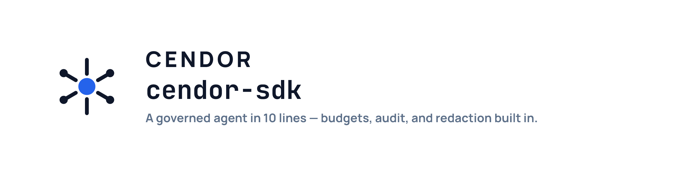
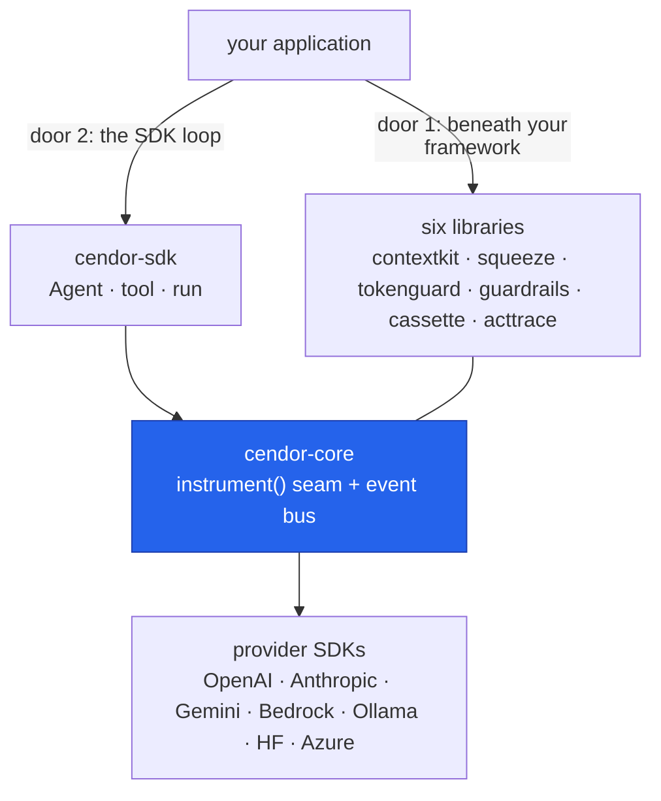

<p align="center">
  <picture>
    <source media="(prefers-color-scheme: dark)" srcset=".github/assets/cendor-sdk-banner-dark.png">
    
  </picture>
</p>

**A governed agent in 10 lines — cost budgets, tamper-evident audit, and PII redaction built in.**

A thin, provider-agnostic agent SDK where governance is the *foundation*, not a plugin — the second door into the [Cendor](https://github.com/cendorhq/cendor-libs) stack.

   [](https://github.com/astral-sh/ruff)  

<!-- cendor:downloads:start — self-hosted badges from cendor.ai (no third party in the render path).
     The numbers live inside the SVGs, regenerated daily from the committed ledger, so this file
     never goes stale. PyPI excludes index mirrors; npm publishes no mirror filter, which is why the
     two are shown separately and never summed. Method: https://cendor.ai/downloads -->
[](https://cendor.ai/downloads) [](https://cendor.ai/downloads) [](https://cendor.ai/downloads)
<!-- cendor:downloads:end -->

[**Install**](#install) · [**Governed in 10 lines**](#a-governed-agent-in-10-lines) · [**Why different**](#why-its-different) · [**Providers**](#every-major-provider--one-canonical-loop) · [**Docs**](#docs)

*provider-agnostic · local-first · offline by default · sync **and** async*

> **The second door into Cendor.** One brand, two doors: compose the
> [seven libraries](https://github.com/cendorhq/cendor-libs) beneath *your* framework, or take the whole
> loop — governed — with this SDK. The `budget` / `guard` / `Policy` / `AuditLog` / `trace` you import
> here are the **real** library objects, re-exported for one-import convenience — and since 1.7.0
> that is CI-verified: an identity test suite pins every re-export (`sdk.guard is acttrace.guard`),
> `embed()` is governed pre-flight (a keyless USD budget blocks it before it fires), and the
> pii/secrets bridge honors per-category policy actions.

---


## An agent can have an identity, not just a name (1.20.0)

```python
agent = Agent(name="support", model="gpt-4o", id="reg-42")   # id -> gen_ai.agent.id
```

A name is a label: two agents in two apps can share one, and renaming an agent loses its history. Pass
`id=` and it rides the semconv `gen_ai.agent.id` on every span of that agent's turns — and on its
governance rows, which is how a budget block finally says **which** agent it stopped (measured before
1.20.0: 13 of 386 governance rows named their agent). Give no id and the attribute is simply **omitted**
— never a hash of the name, never a placeholder. Needs `cendor-core >= 1.14` / `cendor-acttrace >= 1.13`.

## Your runs show up in your backend, with no telemetry code (1.19.1)

Configure an OpenTelemetry provider the way you already would (or point `OTEL_EXPORTER_OTLP_ENDPOINT`
at [Cendor Monitor](https://cendor.ai/docs/monitor)) and `run()` does the rest: an `agent.run` root with
its steps as children, usage/cost rollups, your `session` id as `gen_ai.conversation.id`, and — because
the root is the active span — governance correlated to the run, including `governance.*` spans for the
budget or guardrail that stopped it. An explicit `live_spans()`/`liveSpans()` still wins;
`CENDOR_TELEMETRY=off` turns it all off; `CENDOR_DEBUG_TELEMETRY=1` says what was detected. Cendor has
no endpoint, exporter or key — it emits into **your** provider. **Concurrent runs are attributed
per run** since 1.19.1 / `@cendor/sdk` 0.23.2 — before that, two *overlapping* runs could render one
run's call twice and lose the other's, because a scope learned its run from the first event on the
process-wide bus.

## The problem

Governance is best-effort *beneath* a framework — the framework owns the loop, so budgets, audit,
and redaction only ever see what leaks out to a callback. `cendor-sdk` **owns the agent loop**, so
every concern that's fragile beneath a framework becomes first-class here:

- 💸 **Usage is never lost** — every model and tool call flows through one seam, priced in exact `Decimal`.
- 🚦 **Budgets enforce *before* the call** — an over-budget run is refused, not just reported after it billed.
- 🔒 **PII is redacted *before* send** — the provider never sees it.
- 📋 **The whole run is one tamper-evident chain** — every step correlated under a single `trace_id`, `verify()`-able offline.
- 🧪 **Runs replay in tests** — record once, replay forever: offline, deterministic, free.

You don't need to pick a framework or wire the libraries together. (Already have a framework?
Compose the libraries beneath it: `pip install cendor-libs`.)

## Install

```bash
pip install "cendor-sdk[openai,anthropic]"     # provider SDKs are optional extras
pip install "cendor-sdk[all]"                  # every provider + interop, batteries included
# Using uv? Same names, same extras: `uv add` instead of `pip install`.
```

Using an AI coding assistant? `npx @cendor/init` (TS) / `uvx cendor-init` (Python) wires it up — or point it at [cendor.ai/docs/for-ai-assistants](https://cendor.ai/docs/for-ai-assistants).

The install bundles the whole Cendor stack (`cendor-core`, `tokenguard`, `acttrace`, `contextkit`,
`squeeze`, `cassette`) by dependency — you install once and import only from `cendor.sdk`. Provider
SDKs stay optional extras: `[openai]`, `[anthropic]`, `[google]`, `[bedrock]`, `[ollama]`,
`[huggingface]`, `[azure]`, `[foundry-local]`, plus `[mcp]` and `[otel]`.

## A governed agent in 10 lines

**Auth:** `OPENAI_API_KEY` from your environment (or `Agent(api_key=…)`, or a pre-built
`client=`). The SDK builds the provider client for you — there's no Cendor-specific key. Full
table: [docs/providers](docs/providers.md#api-keys--credentials).

```python
from cendor.sdk import Agent, tool, run, budget, guard, Policy, AuditLog

@tool
def get_weather(city: str) -> str:
    """Current weather for a city."""
    return f"Sunny in {city}"

agent = Agent(name="assistant", model="gpt-4o", tools=[get_weather],
              instructions="Answer using tools when helpful.")

log = AuditLog(system="support", risk_tier="limited", path="audit.jsonl")
with budget(usd=0.25, on_exceed="block"), guard(Policy.default(), audit=log):
    result = run(agent, "What's the weather in Paris?", audit=log)

print(result.output)                        # -> "It's sunny in Paris."
print(result.cost, result.usage)            # priced in Decimal, budgeted
print([s.name for s in result.tool_steps])  # -> ["get_weather"]
# audit.jsonl: audit_open -> decision -> llm_call -> tool_call -> llm_call, hash-chained &
# verify()-able, all correlated by one trace_id. Wrap in cassette.using("run.json") to replay it.
```

**Ungoverned still works — on `cendor-core` alone.** Every governance layer is optional and
removable; drop the `with` block and `run(agent, ...)` runs bare:

```python
from cendor.sdk import Agent, run
result = run(Agent(name="a", model="gpt-4o", instructions="Be brief."), "Hi")
result = await run.aio(agent, "Hi")   # same call, async
```

> `run.aio` is natively async for OpenAI (Chat + Responses), Anthropic, Ollama, and Hugging Face.
> Gemini and Bedrock have no native async client, so `run.aio` runs them synchronously for now.

## Two doors, one stack

Both doors expose the **same primitives** — start on the SDK and drop down to the libraries later
(or mix them in the same process); it's continuous, never a migration.



## Why it's different

| | Provider lock | Cost budgets | Tamper-evident audit | PII redaction | Record/replay tests | Local-first |
|---|---|---|---|---|---|---|
| OpenAI Agents SDK | OpenAI-centric | ✗ | ✗ | ✗ | ✗ | lib |
| LangGraph | agnostic | DIY | DIY | DIY | DIY | lib |
| Anthropic Agent SDK | Anthropic-centric | ✗ | ✗ | ✗ | ✗ | lib |
| CrewAI / Pydantic AI / ADK | varies | ✗/DIY | ✗ | ✗ | ✗ | lib |
| **cendor-sdk** | **agnostic** | **built-in** | **built-in** | **built-in** | **built-in** | **yes** |

Governance is composed through Cendor's existing **bus / interceptor / `Sink` / `Compressor`** seams,
correlated by `trace()` — **zero SDK-specific glue**. The SDK adds no governance machinery of its
own; each wrapper attaches to a `cendor-core` seam, which is why the same line works under the SDK
loop, under a bare instrumented client, and in both languages:

| Wrapper | Seam | Moment |
|---|---|---|
| `budget(on_exceed="block"/"downgrade")` | pre-flight interceptor | before the call runs |
| `budget(on_exceed="raise")` | bus subscriber | after usage lands |
| `track` / `report` | bus subscriber | after usage lands |
| `guard(Policy...)` | pre-flight interceptor | before the request leaves |
| `AuditLog` | bus subscriber | every event, appended to the chain |
| `cassette` | subscriber (record) + interceptor (replay) | around the call |

## Multi-agent, one correlated tree

Handoff, supervisor/router, and sequential/parallel pipelines — with the correlation that was
*impossible beneath frameworks*. A whole multi-agent run is one governed, `trace_id`-correlated tree
on one verifiable audit chain. Handoff even works **across providers**:

```python
from cendor.sdk import Agent, run

writer  = Agent(name="writer",  model="claude-opus-4-8", instructions="Write the brief.")
planner = Agent(name="planner", model="gpt-4o", instructions="Plan, then hand off.",
                handoffs=["writer"])

result = run([planner, writer], "Research X and write a brief")   # OpenAI -> Anthropic handoff
print(result.agents)     # ["planner", "writer"]
```

`Agent(max_usd=...)` caps a single agent's segment; `supervisor()` gives you a router, and
`sequential()` / `parallel()` the pipeline shapes.

## Every major provider — one canonical loop

The provider is inferred from the model id (override with `provider=`). History is held in one
canonical shape, so a run can **hand off between providers** without rewriting it.

| Provider | Models | Extra |
|---|---|---|
| **OpenAI** | Chat Completions + Responses API | `[openai]` |
| **Anthropic** | Messages API | `[anthropic]` |
| **Google Gemini** | `google-genai` | `[google]` |
| **AWS Bedrock** | Converse API | `[bedrock]` |
| **Ollama** | local models | `[ollama]` |
| **Hugging Face** | Inference / endpoints | `[huggingface]` |
| **Azure AI Foundry** | deployments via the OpenAI v1 endpoint (Chat + Responses) | `[azure]` |
| **Foundry Local** | on-device, OpenAI-compatible | `[foundry-local]` |

## More in the box

Everything a real agent needs — all governed through the same seams:

- **Streaming** — `run.stream` / `run.astream` yield text deltas + tool events (native for the OpenAI family + Ollama).
- **Structured output** — a dataclass / Pydantic / JSON-schema `output_type` uses each provider's native schema mode.
- **Reasoning & control** — `Agent.extra` passes `tool_choice`, `reasoning_effort`, `top_p`, `stop`, …; o-series `temperature` is handled for you.
- **RAG** — `VectorIndex` + `Agent(retriever=…)` inject governed retrieval, or expose your store as a `@tool`.
- **Memory** — `Session` (conversation), `SummarizingSession` (rolling summary), `SQLiteSessionStore` (durable), `context_budget` (fit the window).
- **Embeddings** — `embed()` / `aembed()` capture RAG calls on the same cost/audit tree.
- **Cost governance for any model** — `register_model_price(...)` so budgets bind on custom / deployment-named ids.
- **Interop** — MCP tools, A2A server/client, Foundry/Copilot adapter, OpenTelemetry span trees, and human-in-the-loop approvals on the same chain.
- **Production hardening** — retry policies, and checkpointed/resumable runs so a crashed run continues where it stopped.

```python
from cendor.sdk import budget

with budget(usd=0.50, on_exceed="downgrade", downgrade={"gpt-4o": "gpt-4o-mini"}):
    run(agent, "...")     # reroutes to the cheaper model before the call runs
```

## Design principles

1. **Cooperate through core.** The SDK hard-depends only on `cendor-core`; every governance tool integrates through core's bus and interceptor seams — nothing patches anything.
2. **Governed by default, escapable.** Each layer is one argument or one `with` block; removing it never breaks the loop.
3. **Local-first, no servers.** Sessions, checkpoints, audit chains, and cassettes are local files. Cloud and OpenTelemetry export are optional and opt-in.
4. **Same API in both languages.** `snake_case` ↔ `camelCase`, identical defaults and error names — see the [parity matrix](https://cendor.ai/docs/languages). Also available as [`@cendor/sdk`](https://github.com/cendorhq/cendor-sdk-js) on npm.

## Scope & honest limits

- **`on_exceed="raise"` overshoots by one call** — it's post-flight. For a true ceiling use `"block"`.
- **Unpriced models record `$0`,** so a USD cap can't bind on them — `register_model_price(...)` or use a token cap.
- **`guard` redacts what its detectors find** — regex/pattern detectors plus Presidio NER (an optional extra). See [acttrace](https://cendor.ai/docs/acttrace) for coverage.
- **`guard` / interceptors are process-global** — they register on the single in-process bus, so install policy once at startup rather than toggling per request.
- **Evidence, not compliance.** The audit chain supports a compliance case; it doesn't make one, and it isn't legal advice.

## Docs

Full documentation lives in [`docs/`](docs/) — every page renders on GitHub, and is published as a
searchable site with a page-wide **Python / TypeScript** toggle at
[cendor.ai/docs/sdk](https://cendor.ai/docs/sdk/getting-started):

| Page | Covers |
|---|---|
| [docs/index.md](docs/index.md) | Start here — which door, the pages, what "governed" means |
| [docs/getting-started.md](docs/getting-started.md) | Install (pip / npm), a first governed agent, where each concept lives |
| [docs/agents.md](docs/agents.md) | `Agent`, `tool`, `run`, `Result`, structured output, streaming, multimodal |
| [docs/governance.md](docs/governance.md) | Budgets, attribution, audit + redaction, record/replay testing |
| [docs/memory.md](docs/memory.md) | Sessions, durable stores, summarization, window fitting |
| [docs/rag.md](docs/rag.md) | Governed embeddings, `VectorIndex`, always-on & agentic retrieval |
| [docs/multi-agent.md](docs/multi-agent.md) | Handoff, supervisor/router, sequential & parallel |
| [docs/providers.md](docs/providers.md) | The ten provider paths; HF / Azure AI Foundry / Foundry Local setup |
| [docs/interop.md](docs/interop.md) | MCP, A2A, Foundry/Copilot, OTel span tree, human-in-the-loop |
| [docs/hardening.md](docs/hardening.md) | Retries, checkpointed/resumable runs, durable memory |
| [docs/eval.md](docs/eval.md) | Cassette-backed governed eval & regression testing |
| [docs/faq.md](docs/faq.md) | Common questions — including "libraries or SDK?" |
| [CHANGELOG.md](CHANGELOG.md) | Release history |
| [examples/](examples/) | Runnable, network-free examples |

## Development

This repo ships **`cendor.sdk` only** (a PEP 420 namespace package — there is never a top-level
`src/cendor/__init__.py`). It consumes the published Cendor libraries; for local iteration, a dev
source override in `pyproject.toml` resolves them from a sibling `../cendor-libs` monorepo checkout.

```bash
uv sync                        # install (with the dev source override)
uv run pytest -q               # tests — no network, ever
uv run ruff check . && uv run ruff format --check .
uv run mypy -p cendor.sdk
```

CI runs the above plus a **namespace-guard** check (no `src/cendor/__init__.py`) on Linux + Windows.
Releases are tag-triggered (`v*.*.*`) and publish to PyPI via OIDC trusted publishing
(`.github/workflows/release.yml`). The PyPI page is rendered from [`README-pypi.md`](README-pypi.md).

Contributing: [`CONTRIBUTING.md`](CONTRIBUTING.md) (setup, the gates, PR conventions) ·
[`CLAUDE.md`](CLAUDE.md) (the cardinal rules, for humans and AI assistants alike) ·
[`CODE_OF_CONDUCT.md`](CODE_OF_CONDUCT.md). Found a security problem? Please don't open a public
issue — see [`SECURITY.md`](SECURITY.md).

## License & disclaimer

Licensed under the **Apache License 2.0** — see [`LICENSE`](LICENSE) and [`NOTICE`](NOTICE).
Copyright 2026 Raghav Mishra (PowerAI Labs).

> **No warranty — use at your own risk.** This software is provided on an **"AS IS" BASIS, WITHOUT
> WARRANTIES OR CONDITIONS OF ANY KIND**, and the authors and contributors carry **no liability** for
> any damages, losses, or business impact arising from its use or inability to use it — see Apache-2.0
> **§7 (Disclaimer of Warranty)** and **§8 (Limitation of Liability)** in [`LICENSE`](LICENSE). You are
> solely responsible for determining suitability and assume all risk. (`acttrace` in particular
> produces *evidence to support* compliance — not a guarantee, and not legal advice.)

---
*An open-source project by [PowerAI Labs](https://powerailabs.dev). Apache-2.0 licensed.*
