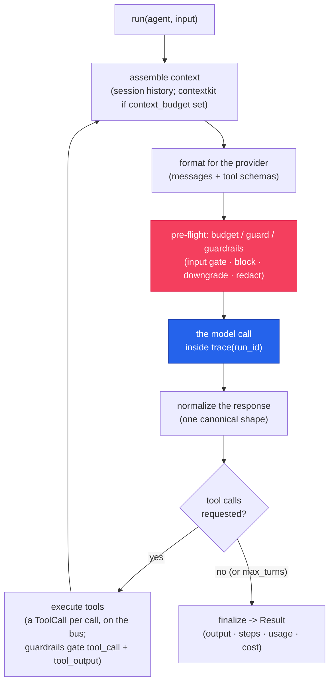

# Agents & the loop

`Agent` declares *what* the agent is (model, instructions, tools); `run` executes the ReAct loop
until the model produces a final answer; `Result` is the receipt — output, steps, tokens, and
decimal cost. Nothing here requires governance; everything here is what governance attaches to.

## Quickstart

<!-- tabs: lang -->
<!-- tab: Python -->

```python
from cendor.sdk import Agent, tool, run

@tool
def search(query: str, top_k: int = 3) -> list[str]:
    """Search the knowledge base."""
    ...

agent = Agent(name="assistant", model="gpt-4o", tools=[search],
              instructions="Answer using tools when helpful.")
result = run(agent, "What's our refund policy?")
print(result.output)
```

<!-- tab: TypeScript -->

```ts
import { Agent, tool, run } from '@cendor/sdk';
import { z } from 'zod';

const search = tool(async ({ query, topK }) => { /* ... */ }, {
  name: 'search',
  description: 'Search the knowledge base',
  parameters: z.object({ query: z.string(), topK: z.number().default(3) }),
});

const agent = new Agent({ name: 'assistant', model: 'gpt-4o', tools: [search],
                          instructions: 'Answer using tools when helpful.' });
const result = await run(agent, "What's our refund policy?");
console.log(result.output);
```

<!-- /tabs -->

## Core concepts

### `Agent` — declarative, provider-inferred

<!-- tabs: lang -->
<!-- tab: Python -->

```python
Agent(
    name: str,
    model: str,                    # any supported model id: "gpt-4o", "claude-opus-4-8", ...
    instructions: str = "",        # the system prompt
    tools: list = [],              # @tool-decorated callables or Tool objects
    provider: str | None = None,   # override provider inference from the model id
    output_type: type | dict | None = None,  # structured output (dataclass / JSON schema)
    max_turns: int = 8,            # ReAct loop bound (termination guarantee)
    context_budget: int | None = None,  # assemble history to a token budget via contextkit
    temperature: float | None = None,
    max_tokens: int | None = None,
    extra: dict = {},              # raw provider request kwargs (tool_choice, reasoning_effort, …) — see Providers
)
```

<!-- tab: TypeScript -->

<!-- ts-check: skip -->

```ts
new Agent({
  name: string,
  model: string,                 // any supported model id: 'gpt-4o', 'claude-opus-4-8', ...
  instructions?: string,         // the system prompt
  tools?: (Tool | ToolFn)[],     // tool(...)-wrapped functions
  provider?: string,             // override provider inference from the model id
  outputType?: ZodType | object, // structured output (zod schema / raw JSON schema)
  maxTurns?: number,             // ReAct loop bound, default 8 (termination guarantee)
  contextBudget?: number,        // assemble history to a token budget via contextkit
  temperature?: number,
  maxTokens?: number,
  extra?: Record<string, unknown>, // raw provider request kwargs (tool_choice, reasoningEffort, …) — see Providers
})
```

<!-- /tabs -->

The provider is inferred from the model id (`gpt-*`/`o*` → OpenAI, `claude-*` → Anthropic,
`gemini-*` → Google, …); pass `provider=` to override. Hugging Face and Microsoft Foundry
(formerly Azure AI Foundry) ids aren't prefix-inferable, so those always take an explicit
`provider=` — see [Providers](providers.md).

`api_key` / `base_url` / `client` are also accepted: keys resolve **explicit `api_key=` → the
provider's standard env var (`OPENAI_API_KEY`, `ANTHROPIC_API_KEY`, `GOOGLE_API_KEY`, the AWS
credential chain for Bedrock, …) → a keyless placeholder** (so offline flows work; a live call then
401s). `base_url` targets a gateway or self-hosted endpoint, and `client` hands over a pre-built SDK
client (instrumented on adoption, so budgets/guard/audit still apply). The full matrix is in
[API keys & credentials](providers.md#api-keys--credentials). `Agent(cache=True)` marks
the stable prefix (system prompt + tools) for provider prompt caching — Anthropic `cache_control`
today, a no-op elsewhere — and cached tokens price through to `Result.cost` automatically.

### `tool` — schema from the function itself

`@tool` (Python) / `tool(...)` (TypeScript) turns a plain function into a `Tool`. In Python the
JSON Schema comes from the type hints and the description from the docstring; in TypeScript —
no runtime type hints — the schema is a [zod 4](https://zod.dev) object, the same pattern as the
Vercel AI SDK. Sync and async both work. (zod ships with `@cendor/sdk`; pass a pre-built JSON
Schema via `jsonSchema:` if you'd rather not use zod.)

<!-- tabs: lang -->
<!-- tab: Python -->

```python
from cendor.sdk import tool

@tool
def search(query: str, top_k: int = 3) -> list[str]:
    """Search the knowledge base."""
    ...

@tool(name="lookup")
async def fetch(url: str) -> str:
    """Fetch a URL."""
    ...
```

<!-- tab: TypeScript -->

```ts
import { tool } from '@cendor/sdk';
import { z } from 'zod';

const search = tool(async ({ query, topK }) => { /* ... */ }, {
  name: 'search',
  description: 'Search the knowledge base',
  parameters: z.object({ query: z.string(), topK: z.number().default(3) }),
});
// name defaults to the function's name; async and sync tools both work
```

<!-- /tabs -->

Either way the schema is formatted per provider automatically (OpenAI `functions`, Anthropic
`tools`, Gemini function declarations, Bedrock `toolConfig`), and every execution flows through `cendor-core`'s
`instrument_tool`, emitting a `ToolCall` on the bus — correlated by `trace_id`, recorded by the
[audit chain](governance.md), replayable by [cassette](governance.md#testing--record-once-replay-forever).

### `run` — the loop, bounded

<!-- tabs: lang -->
<!-- tab: Python -->

```python
run(agent, input, *, session=None, audit=None, max_turns=None, retry=None, on_step=None) -> Result
await run.aio(agent, input, ...)     # async — same signature
```

<!-- tab: TypeScript -->

<!-- ts-check: skip -->

```ts
await run(agent, input, { session?, audit?, maxTurns?, retry?, onStep? })  // -> Result
// TS is async throughout; run.stream / run.astream yield events (see Streaming below)
```

<!-- /tabs -->

- `input` — a string or a list of messages.
- `session` — a `Session` for multi-turn memory ([Memory & sessions](memory.md)).
- `audit` — an `AuditLog`; each agent step is wrapped in an acttrace `decision()` so the chain
  correlates every `llm_call`/`tool_call` by `decision_id` and the run's `trace_id`.
- `retry` — a `RetryPolicy` for transient failures ([Production hardening](hardening.md)).
- `on_step` — a live-progress callback, invoked with each `Step` as it completes.

`max_turns` (default 8) bounds the loop — the termination guarantee. A run that ends without a
final answer (e.g. `max_turns` hit mid tool-loop) sets `Result.incomplete = True`.

### `Result` — the receipt

<!-- tabs: lang -->
<!-- tab: Python -->

```python
result.output        # final answer (str) or the parsed structured object
result.steps         # list[Step] — one per LLMCall/ToolCall, in order, correlated by trace_id
result.llm_steps     # the model turns
result.tool_steps    # the tool executions
result.usage         # aggregate Usage across the run
result.cost          # aggregate Money (Decimal) across the run
result.trace_id      # the run id every step shares
result.messages      # the full conversation (canonical/OpenAI-shape messages)
result.incomplete    # True when the run ended without a final answer
result.tool_failed   # True if any tool raised during the run
result.tool_errors   # list[ToolError] — .tool, .type, .message, .tool_call_id
```

<!-- tab: TypeScript -->

```ts
result.output        // final answer (string) or the parsed structured object
result.steps         // Step[] — one per LLMCall/ToolCall, in order, correlated by traceId
result.llmSteps      // the model turns
result.toolSteps     // the tool executions
result.usage         // aggregate usage across the run
result.cost          // aggregate Money (decimal) across the run
result.traceId       // the run id every step shares
result.messages      // the full conversation (canonical/OpenAI-shape messages)
result.incomplete    // true when the run ended without a final answer
result.toolFailed    // true if any tool threw during the run
result.toolErrors    // ToolError[] — .tool, .type, .message, .toolCallId
```

<!-- /tabs -->

Each `Step` wraps the actual `LLMCall`/`ToolCall` from the bus (`.call`), with `.agent`, `.kind`
(`"llm"`/`"tool"`), and `.name` (model id or tool name).

#### When a tool fails

A tool that raises does **not** end the run. The loop turns the exception into
`"[error] <Type>: <message>"`, hands that to the model, and continues — which is what lets a model
apologise, retry with different arguments, or route around the failure. That string is a contract with
the model and never changes.

What it used to cost the *caller* was any way to notice. Read `tool_errors` instead of matching text:

<!-- tabs: lang -->
<!-- tab: Python -->

```python
result = run(agent, "refund order 42")

if result.tool_failed:
    for err in result.tool_errors:
        print(err.tool, err.type, err.message)   # "refund" "TimeoutError" "upstream took 30s"
```

<!-- tab: TypeScript -->

```ts
const result = await run(agent, 'refund order 42');

if (result.toolFailed) {
  for (const err of result.toolErrors) {
    console.log(err.tool, err.type, err.message); // "refund" "TimeoutError" "upstream took 30s"
  }
}
```

<!-- /tabs -->

`type` is the exception/error class name, or `"UnknownTool"` when the model asked for a tool the agent
doesn't have. A guardrail **block** is not a tool failure — it is a decision, and appears in
`guardrail_decisions` / `guardrailDecisions` instead.

Two things worth knowing, both measured:

- **A failed tool produces no `Step`.** `cendor-core` emits a `ToolCall` when a tool *returns*, not
  when it raises, so a failure appears in neither `steps` nor `tool_steps`, and no `execute_tool` span
  is rendered for it. `tool_errors` is the surface that sees those; `tool_steps` still counts only
  successful executions.
- **`incomplete` stays `False`.** A run whose tools all failed but which produced a final answer is a
  *complete* run. Check `tool_failed` as well as `incomplete` if a failed tool should fail your job.

### Structured output

`output_type` accepts a dataclass or Pydantic model (Python), a zod schema (TypeScript), or a
raw JSON-schema object in either language. The schema is sent via each provider's native
structured-output feature — OpenAI `json_schema`, Ollama `format`, Gemini `response_schema`,
Anthropic `output_config.format` (supported models); **Bedrock** forces a synthetic-tool
`toolChoice` shaped by the schema when the agent has **no tools** (a forced choice can't coexist
with real tools on Converse), and otherwise (older Anthropic models, Bedrock with tools) embeds it
in the JSON instruction — far more reliable than a bare "respond with JSON". The final message is
parsed into the requested type:

<!-- tabs: lang -->
<!-- tab: Python -->

```python
from dataclasses import dataclass

@dataclass
class Weather:
    city: str
    conditions: str

agent = Agent(name="w", model="gpt-4o", instructions="Report weather.", output_type=Weather)
result = run(agent, "Weather in Paris?")
assert isinstance(result.output, Weather)
```

<!-- tab: TypeScript -->

```ts
import { z } from 'zod';

const Weather = z.object({ city: z.string(), conditions: z.string() });

const agent = new Agent({ name: 'w', model: 'gpt-4o', instructions: 'Report weather.',
                          outputType: Weather });
const result = await run(agent, 'Weather in Paris?');
// result.output is the JSON-parsed object, validated against the zod schema
```

<!-- /tabs -->

### Streaming

`run.stream` (sync) / `run.astream` (async) yield events as the run progresses. The events are the
**`StreamEvent` union** — `TextDelta` (a chunk of the visible answer), `ThinkingDelta` (a chunk of
streamed **reasoning/thinking**, kept separate from the answer), `ToolCallEvent` (a tool is about to
run), `ToolResultEvent` (a tool returned its result), and the terminal `RunComplete` (which carries
the same `Result` a blocking `run()` returns). Token-by-token reassembly is native on the OpenAI
**Chat** family (Hugging Face, Microsoft Foundry, and Foundry Local ride the same client), on
**Anthropic**, and on Ollama — tool-call deltas included. OpenAI **Responses**, Gemini, and Bedrock
make a non-streamed call and yield the answer as one delta: same events, coarser granularity.
Multi-agent handoff runs stream too ([Multi-agent](multi-agent.md)).

`ThinkingDelta` (SDK 1.13 / 0.18) is emitted **only** for providers that stream reasoning as it is
produced — Ollama `think` models and OpenAI-compatible endpoints that stream `reasoning_content`. It
is additive: a provider that doesn't stream thinking simply yields none, and a consumer that doesn't
match on it is unaffected. Keeping it separate from `TextDelta` lets a UI render or hide reasoning
independently of the answer.

<!-- tabs: lang -->
<!-- tab: Python -->

```python
from cendor.sdk import Agent, run, TextDelta, ThinkingDelta, ToolCallEvent, ToolResultEvent, RunComplete

agent = Agent(name="a", model="gpt-4o", instructions="Be brief.")
for event in run.stream(agent, "Tell me a joke"):
    if isinstance(event, ThinkingDelta):
        print(event.text, end="", flush=True)   # reasoning — render or hide separately
    elif isinstance(event, TextDelta):
        print(event.text, end="", flush=True)
    elif isinstance(event, ToolCallEvent):
        print(f"\n[calling {event.name}({event.arguments})]")
    elif isinstance(event, ToolResultEvent):
        print(f"\n[{event.name} → {event.result}]")
    elif isinstance(event, RunComplete):
        print("\ncost:", event.result.cost)
```

<!-- tab: TypeScript -->

```ts
import { Agent, run, TextDelta, ThinkingDelta, ToolCallEvent, ToolResultEvent, RunComplete } from '@cendor/sdk';

const agent = new Agent({ name: 'a', model: 'gpt-4o', instructions: 'Be brief.' });
for await (const event of run.stream(agent, 'Tell me a joke')) {
  if (event instanceof ThinkingDelta) process.stderr.write(event.text); // reasoning, shown separately
  else if (event instanceof TextDelta) process.stdout.write(event.text);
  else if (event instanceof ToolCallEvent) console.log(`\n[calling ${event.name}]`);
  else if (event instanceof ToolResultEvent) console.log(`\n[${event.name} → ${event.result}]`);
  else if (event instanceof RunComplete) console.log('\ncost:', event.result.cost?.toString());
}
```

<!-- /tabs -->

Reasoning text also lands on your telemetry as thinking content only when
[content capture](observability.md) is opted in (off by default), parsed out of the raw response —
the same parts `ThinkingDelta` surfaces live.

<!-- tabs: lang -->
<!-- tab: Python -->

**Stream scopes don't leak into your consumer.** Events are yielded from a generator, but the run's
ambient scopes — `trace()`, `budget()`, `track()` — are captured **when the stream is created**, not
re-read each time you advance the iterator (SDK 1.13). So code you run *between* deltas (a `print`, a
DB write, even another model call of your own) does **not** accidentally inherit the run's budget or
attribution tags.

<!-- tab: TypeScript -->

> **Not an issue in TypeScript.** The TS runner produces stream events through an internal queue, so
> your `for await` body never executes inside the run's scope in the first place — the
> capture-at-creation guarantee holds structurally.

<!-- /tabs -->

### Multimodal input

A message's `content` may be a parts list (OpenAI shape). The OpenAI family passes it through
natively; Anthropic and Gemini translate images to their block formats (base64 or URL); Bedrock
keeps the text.

<!-- tabs: lang -->
<!-- tab: Python -->

```python
run(agent, [{"role": "user", "content": [
    {"type": "text", "text": "What's in this image?"},
    {"type": "image_url", "image_url": {"url": "data:image/png;base64,...."}},
]}])
```

<!-- tab: TypeScript -->

```ts
await run(agent, [{ role: 'user', content: [
  { type: 'text', text: "What's in this image?" },
  { type: 'image_url', image_url: { url: 'data:image/png;base64,....' } },
] }]);
```

<!-- /tabs -->

## How it works

One turn of the loop, top to bottom — governance fires at the seam, not inside your code:



Every model call runs inside `trace(run_id)`, so usage and cost are captured on the bus and every
subscriber — budgets, audit, cassette — sees the same correlated events.

## Plugs into the stack

The loop *is* the composition point: `context_budget` pulls in
[`contextkit`](/docs/contextkit) (and [`squeeze`](/docs/squeeze) when installed), governance
wrappers pull in [`tokenguard`](/docs/tokenguard) and [`acttrace`](/docs/acttrace),
[`Agent(guardrails=[…])`](guardrails.md) attaches the [`cendor-guardrails`](/docs/guardrails)
four-stage gate, and [`cassette`](/docs/cassette) records/replays the whole trajectory. All through
[`cendor-core`](/docs/core)'s seams — the SDK contains no governance logic of its own.

## Reference

A few names that round out the surface:

| Name | What it is |
|---|---|
| `Run` | an alias of `Result` (`Run is Result` / `Run === Result`) — same class, either name |
| `Agent(extra=…)` / `extra` | raw provider request-kwargs merged into every call (`tool_choice`, `reasoning_effort`, `top_p`, `seed`, …) — [Providers → `Agent.extra`](providers.md#provider-params--reasoning--agentextra) |
| `StreamEvent` | the streaming union: `TextDelta` \| `ThinkingDelta` \| `ToolCallEvent` \| `ToolResultEvent` \| `RunComplete` |
| `ThinkingDelta` | a streamed **reasoning/thinking** chunk (`.text`), separate from `TextDelta` — emitted only by providers that stream reasoning (Ollama `think`, OpenAI-compatible `reasoning_content`) |
| `ParsedResponse` / `ToolInvocation` | the provider-parse shapes — [Providers → provider-author reference](providers.md#provider-author-reference) |

### TypeScript-only / low-level exports

`@cendor/sdk` also exports a low-level tail. A few are genuinely useful; the rest are provider-author
or internal surface, declared here so it's documented, not hidden. (These are TypeScript exports;
Python's equivalents differ — e.g. Python has no in-memory session *store*, just `Session`.)

| Export | What it is |
|---|---|
| `MemorySessionStore` | an in-memory keyed session store (TS-only; Python uses a plain `Session`) — [Memory](memory.md#durable-multi-conversation-memory--sqlitesessionstore) |
| `asTool(fn \| tool)` | coerce a bare function **or** an existing `Tool` into a `Tool` (idempotent — it's what `Agent` does to its `tools` array). It does **not** wrap an `Agent`; to build a tool from a function use `tool(...)` |
| `runAgents` / `runAgentsAsync` / `streamAgents` | the low-level array forms of a handoff team — [Multi-agent](multi-agent.md#sequential--parallel-pipelines) |
| `Money` / `sumMoney` | decimal-money value + summation (re-exported from `@cendor/core`) |
| `Verdict` / `GuardrailDecision` | a guardrail check's result + the bus evidence event |
| `formatContext` | join retrieved chunks into a single context string |
| `callWithRetry` | run a function under a `RetryPolicy` directly (what `run(retry=…)` uses) |
| `alwaysApprove` / `alwaysReject` | ready-made test approvers for `requireApproval` |
| `asCheckpointer` | coerce a path or `Checkpointer` into a `Checkpointer` |
| `resolveProvider` / `inferProvider` / `getProvider` / `assistantMessage` / `toolResultMessage` / `Provider` | provider-author surface for building a custom provider adapter |

## Honest limits

- **The loop is bounded, not clever.** `max_turns` is the only termination guarantee; a model
  that never answers finishes `incomplete`, it doesn't error.
- **A tool that raises is reported, not raised.** The exception reaches the model as
  `"[error] …"` and the run continues; the caller reads
  [`result.tool_errors`](#when-a-tool-fails). Two honest edges: a failed tool emits no `ToolCall`, so
  it is absent from `tool_steps` and from the span tree; and a tool whose *own* output starts with
  `"[error] "` is indistinguishable from one that failed.
- **Token-level streaming is the OpenAI Chat family, Anthropic, and Ollama** (plus Hugging Face,
  Microsoft Foundry, and Foundry Local, which ride the OpenAI Chat client). OpenAI Responses, Gemini,
  and Bedrock fall back to a non-streamed call and yield one whole-response delta — same events,
  coarser granularity.
- **`ThinkingDelta` needs a provider that streams reasoning** (Ollama `think` models,
  OpenAI-compatible `reasoning_content`); others yield none. And a text-estimated streamed usage count
  can't see thinking tokens — they aren't in the streamed text — so it undercounts reasoning spend
  (flagged `usage_estimated`; see [Observability](/docs/observability)).
- **Provider inference is by model-id prefix.** Hub ids and deployment names (Hugging Face,
  Azure) always need an explicit `provider=` — see [Providers](providers.md).
- **Structured output is provider-mediated.** Where a provider has no native JSON-schema mode,
  the schema rides the instruction (or, for a **tool-less** Bedrock agent, a forced-`toolChoice`
  synthetic tool) — reliable in practice, but not a grammar-level guarantee.
