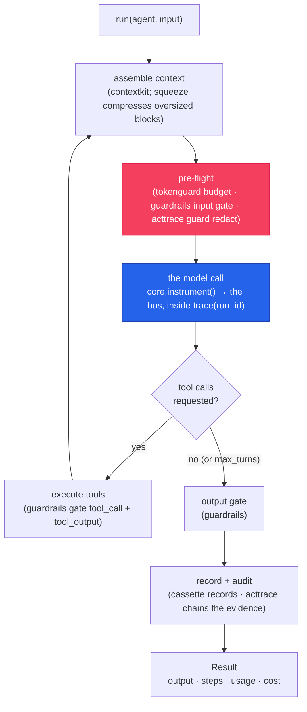

# Architecture — the libraries inside the SDK

`cendor-sdk` is **two layers, one install**: an agent loop on top, and the seven Cendor libraries
underneath. The loop gives you `Agent`, `tool`, `run`, sessions, RAG, multi-agent handoff, and
interop; **every governance behaviour is a library beneath it** — the SDK contains no governance
logic of its own, it just wires the libraries to the loop through
[`cendor-core`](/docs/core)'s event bus. This page is the map: where each library shows up in the
SDK, and which SDK surface it powers.

## The two layers

The SDK adds the *orchestration* — the ReAct loop, tool dispatch, handoff, memory, retrieval — and
delegates every *governance* concern (context, cost, safety, evidence, testing) downward. So the
count that matters is **seven libraries**: the six tools plus the `cendor-core` foundation they all
stand on.

before the call · pre-flight

contextkitassemble

squeezecompress

tokenguardbudget

guardrailsinput gate

acttraceredact

→

the call

coreinstrument()

→

after · automatic, via the bus

guardrailstool + output gate

cassetterecord

acttraceaudit

<b>cendor-core</b> — the <em>instrument()</em> seam + one event bus beneath it all. Every stage inside the amber band is a library subscribing on this bus, never a direct import; the band itself is <b>cendor-sdk</b>'s <em>run()</em> loop, driving each turn. The SDK adds the loop, not the governance.

Two libraries act on *both* sides of a call — **guardrails** gates the input and the output,
**acttrace** guards (redacts) before send and audits after. Everything ships under the `cendor.*`
(Python) / `@cendor/*` (TypeScript) namespace; the SDK re-exports the governance objects you reach
for, so `from cendor.sdk import budget` is the *same* `budget` as
`from cendor.tokenguard import budget` — the per-library tables below say exactly what is an
identical re-export, what is SDK-owned, and where a thin wrapper sits in between. Drop down to the
libraries at any time, it's continuous, never a migration.

## Where each library is used in the SDK

One section per library. Each carries a **"Where it's used in the SDK"** table — the SDK symbol or
parameter, what the library does there, and the SDK concept page that documents it — plus the
absolute link to the library's own docs.

### contextkit — fit history to the window ●

Every turn, the loop assembles the running conversation (and any retrieved passages) into the
model's token budget. Set `Agent(context_budget=…)` / `contextBudget` and each turn packs history
through contextkit, emitting an audited `AssemblyReport` — a receipt of what was kept, shrunk, or
dropped.

| SDK surface | What contextkit does there | Concept page |
|---|---|---|
| `Agent(context_budget=…)` / `contextBudget` | assemble history to a token budget, once per turn | [Memory & sessions](memory.md#fitting-memory-to-the-window--context_budget) |
| the runner's per-turn assembly | packs `Session` history + retriever passages into the window | [Agents & the loop](agents.md#core-concepts) |
| RAG passage injection | retrieved context enters assembly like any other block | [Retrieval (RAG)](rag.md) |

Full library docs: [/docs/contextkit](/docs/contextkit).

### squeeze — compress oversized blocks ●

**squeeze has no direct SDK API — and that's deliberate.** It is a hard dependency, but you never
call it from `cendor.sdk` — and the SDK loop itself never reaches it today: `context_budget` packs
history as a messages block, which contextkit trims by peeling the oldest turns, never by
compression. squeeze engages when you drop down to the libraries: it satisfies
[`cendor-core`](/docs/core)'s `Compressor` protocol by shape (there is no registration step —
nothing happens at import), and [contextkit](/docs/contextkit) discovers it lazily the moment one
of *your* blocks is marked `evict="compress"`; `compress()` is also always callable directly.
Without squeeze installed, `evict="compress"` falls back to truncation.

| SDK surface | What squeeze does there | Concept page |
|---|---|---|
| *no direct symbol* | satisfies core's `Compressor` protocol; contextkit discovers it lazily at eviction time | (this section) |
| *(none — direct library use)* | mark your own contextkit `Block(…, evict="compress")` or call `compress()` directly; the SDK loop's history block never takes the compress path | [/docs/contextkit](/docs/contextkit) · [/docs/squeeze](/docs/squeeze) |

Full library docs: [/docs/squeeze](/docs/squeeze).

### tokenguard — cap and attribute spend ●

Every governed run prices its calls and can refuse an over-budget one before it fires. The budget,
attribution, and price-table objects are tokenguard's, re-exported from `cendor.sdk`.

| SDK surface | What tokenguard does there | Concept page |
|---|---|---|
| `budget(...)` / `withBudget(...)`, `BudgetExceeded` | pre-flight (or post-flight) spend cap around a run | [Governance → budgets](governance.md#budgets) |
| `track(...)` / `report(...)` | attribute ambient spend by feature / user / agent | [Governance → attribution](governance.md#attribution) |
| `Agent(max_usd=…)` / `maxUsd` | per-agent pre-flight cap (block semantics), enforced per segment | [Multi-agent → per-agent budgets](multi-agent.md#per-agent-budgets--attribution) |
| `register_model_price(...)` / `configure(...)` | price unpriced / custom-deployment models so USD caps bind | [Providers → pricing](providers.md#pricing-unpriced-models) |

Full library docs: [/docs/tokenguard](/docs/tokenguard).

### guardrails — the four-stage gate ●

`Agent(guardrails=[…])` attaches the deterministic [cendor-guardrails](/docs/guardrails) Gate to
four points of the loop — input, tool call, tool result, output — with `block` / `redact` / `flag`.
The rule factories, the LLM-judge helpers, the presets, and the policy loader all come from the
library.

| SDK surface | What guardrails does there | Concept page |
|---|---|---|
| `Agent(guardrails=[…], guardrail_mode=…)` | gate four stages; blocking or parallel execution | [Guardrails](guardrails.md) |
| `rules.*` (`keyword_deny`, `regex_rule`, `intent`, `custom_category`, …) | the deterministic + semantic rule factories | [Guardrails → core concepts](guardrails.md#core-concepts) |
| `judge` / `task_adherence` | build an LLM-judge check (intent / tool-call alignment) | [Guardrails → task adherence](guardrails.md#task-adherence--is-this-tool-call-on-task) |
| `presets`, `policy_schema`, `load_policy` | curated starters + versioned policy files | [Guardrails → hosted rails & config](guardrails.md#hosted-rails-config-as-data--grounding) |

Full library docs: [/docs/guardrails](/docs/guardrails).

### cassette — record once, replay forever ●

Testability is cassette. The eval harness drives it, and you scope a recording with cassette
directly — but **cassette is not re-exported by the SDK.** Import it from the umbrella:
`from cendor import cassette` (Python) / `@cendor/cassette` (TypeScript). It surfaces in the SDK
only through the eval harness (`evaluate` / `EvalCase`).

| SDK surface | What cassette does there | Concept page |
|---|---|---|
| `from cendor import cassette` (**not** `cendor.sdk`) | record/replay a whole run, deterministic + offline | [Governance → testing](governance.md#testing--record-once-replay-forever) |
| the eval harness (`evaluate`, `EvalCase`) | replays recorded trajectories as CI tests — behaviour *and* spend | [Eval & regression testing](eval.md) |

Full library docs: [/docs/cassette](/docs/cassette).

### acttrace — redact + tamper-evident audit ●

Privacy and evidence are acttrace. `guard(Policy…)` redacts PII before the provider sees it; an
`AuditLog` records every step in a hash chain you can `verify()` offline; and the SDK bridges
acttrace's detector catalogue into the Gate as `rules.pii` / `secrets` / `entropy`.

| SDK surface | What acttrace does there | Concept page |
|---|---|---|
| `guard(Policy…)`, `Policy`, `PolicyViolation` | PII/secret redact/block/flag on the interceptor seam — `guard` is the **identical acttrace object** (dual-shape since 1.7.0: scope form or raw interceptor) | [Governance → audit + redaction](governance.md#audit--redaction) |
| `AuditLog`, `verify(...)` | append every event to a tamper-evident chain; verify offline | [Governance → audit + redaction](governance.md#audit--redaction) |
| `rules.pii` / `rules.secrets` / `rules.entropy` | acttrace detectors **bridged** into the Gate, gating all four stages (incl. `tool_output`) | [Guardrails → PII & secrets](guardrails.md#pii--secrets--bridged-from-acttrace) |

Full library docs: [/docs/acttrace](/docs/acttrace). Evidence to support compliance — never a
compliance guarantee.

### core — the seam every call rides ●

`cendor-core` is the foundation: the `instrument()` seam, the in-process event bus, the price
table, and the `trace` correlation the whole loop rides. The SDK's only *hard* dependency is core;
every other library cooperates through it.

| SDK surface | What core does there | Concept page |
|---|---|---|
| the loop's model calls (`instrument`) | wrap the provider client once; publish a normalized `LLMCall` | [Agents & the loop → how it works](agents.md#how-it-works) |
| `embed()` / `aembed()` | the embeddings call rides the instrumented client — core captures it (`metadata.embedding`) and pre-flight budgets/guards apply (core ≥ 1.6) | [Retrieval (RAG)](rag.md) |
| `trace(...)` / `current_trace_id` | correlate every call & tool in a run under one id | [Agents & the loop](agents.md#how-it-works) |
| `prices` / provider detection | count tokens, price usage, detect the provider from the model id | [Providers](providers.md) |

Full library docs: [/docs/core](/docs/core).

## The feature → library map

The canonical map of which library powers which SDK surface. (The [Home](index.md) and
[Getting started](getting-started.md) pages carry short versions; this is the full one.)

| I want to… | SDK surface | Library underneath |
|---|---|---|
| Understand `Agent` / `tool` / `run` / `Result` | the loop | [cendor-core](/docs/core) |
| Fit history to a token budget | `Agent(context_budget=…)` | [contextkit](/docs/contextkit) |
| Compress oversized blocks | via direct contextkit use — `Block(…, evict="compress")` | [squeeze](/docs/squeeze) — no direct SDK symbol |
| Cap spend / attribute cost | `budget` / `track` / `report`, `Agent(max_usd=…)` | [tokenguard](/docs/tokenguard) |
| Block / redact / flag at four stages | `Agent(guardrails=[…])`, `rules.*` | [cendor-guardrails](/docs/guardrails) |
| Redact PII, keep tamper-evident evidence | `guard(Policy…)`, `AuditLog`, `verify` | [acttrace](/docs/acttrace) |
| Record once / replay; gate regressions in CI | `from cendor import cassette`, `evaluate` / `EvalCase` | [cassette](/docs/cassette) |
| Remember across turns / processes | `Session`, `SQLiteSessionStore`, `context_budget` | [contextkit](/docs/contextkit) |
| Give the agent my documents | `Agent(retriever=…)`, `VectorIndex`, `embed` | [contextkit](/docs/contextkit) + [cendor-core](/docs/core) |
| Use more than one agent | `handoff` / `supervisor` / `sequential` / `parallel` | — (SDK orchestration) |
| Connect Gemini / Bedrock / Ollama / HF / Azure | `Agent(provider=…)` | [cendor-core](/docs/core) |
| Survive crashes, retries, long runs | `RetryPolicy`, `checkpoint=` | — (SDK) |

The bottom two rows are the SDK's *own* layer — orchestration and hardening — the only behaviours
not delegated to a library.

## How it works

One governed turn, top to bottom — governance fires at core's seam, not inside your code, and every
touchpoint is a library on the bus:

Because every model and tool call flows through the same bus under one `trace_id`, each library
sees the others' work for free — `acttrace`'s audit log already knows the context decisions, the
cost, the tool calls, and the guardrail verdicts, without importing `contextkit`, `tokenguard`, or
`guardrails`.

## Honest limits

- **The SDK owns orchestration, not governance.** The loop, handoff, and hardening are the SDK's;
  everything else is a library you can also use standalone. If a claim is about cost, safety, or
  evidence, the library docs — and the [parity matrix](/docs/languages) — are the source of truth.
- **squeeze engages only when installed.** With no squeeze present, `evict="compress"` truncates
  instead of compressing — no error, just a coarser result.
- **Evidence, not compliance.** `acttrace` produces evidence to *support* a compliance case; it
  doesn't make one, and the SDK inherits that limit unchanged.
- **Parity is documented, not version-coupled.** Where the TypeScript SDK trails Python (e.g.
  `reask_on_output_trip`, `stream_check_window`), the pages say so and the
  [parity matrix](/docs/languages) is authoritative.
