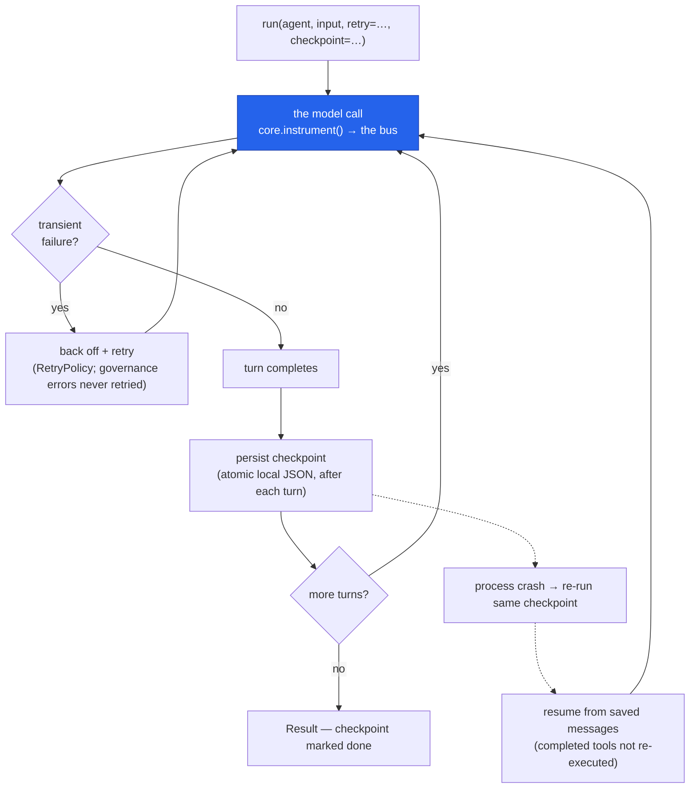

# Production hardening

The "safe for real workloads" layer: retries with backoff for transient failures, checkpointed
runs that resume after a crash, and durable local memory. All local-first — no new failure modes
your provider SDK doesn't already have.

## Quickstart

One run that retries transient failures **and** checkpoints each turn — so a crash resumes from the
saved state instead of starting over (and completed tools don't re-run):

<!-- tabs: lang -->
<!-- tab: Python -->

```python
from cendor.sdk import Agent, run, RetryPolicy

agent = Agent(name="assistant", model="gpt-4o", instructions="…")
result = run(
    agent, "a long task",
    retry=RetryPolicy(max_attempts=5),   # transient failures only — never governance decisions
    checkpoint="run.ckpt.json",          # resume from here if the process crashes
)
```

<!-- tab: TypeScript -->

```ts
import { Agent, run, RetryPolicy } from '@cendor/sdk';

const agent = new Agent({ name: 'assistant', model: 'gpt-4o', instructions: '…' });
const result = await run(agent, 'a long task', {
  retry: new RetryPolicy({ maxAttempts: 5 }),   // transient failures only — never governance decisions
  checkpoint: 'run.ckpt.json',                   // resume from here if the process crashes
});
```

<!-- /tabs -->

## Core concepts

### Retries & backoff — `RetryPolicy`

Pass a `RetryPolicy` to retry **transient** model-call failures (timeouts, connection errors,
rate limits, 5xx) with exponential backoff. Governance decisions (`BudgetExceeded`,
`PolicyViolation`) are **never** retried — they're terminal by design.

<!-- tabs: lang -->
<!-- tab: Python -->

```python
from cendor.sdk import Agent, run, RetryPolicy

agent = Agent(name="assistant", model="gpt-4o", instructions="…")
result = run(agent, "…", retry=RetryPolicy(max_attempts=5, backoff_base=0.5))
```

<!-- tab: TypeScript -->

```ts
import { Agent, run, RetryPolicy } from '@cendor/sdk';

const agent = new Agent({ name: 'assistant', model: 'gpt-4o', instructions: '…' });
const result = await run(agent, '…', { retry: new RetryPolicy({ maxAttempts: 5, backoffBase: 0.5 }) });
```

<!-- /tabs -->

`RetryPolicy` fields: `max_attempts`, `backoff_base`, `backoff_factor`, `max_backoff`,
`should_retry` (a predicate — defaults to `default_is_transient`), and `sleep` (injectable, so
tests run instantly) — camelCase in TypeScript. Only the *successful* attempt emits an `LLMCall`,
so usage and cost are never double-counted.

### Checkpointed & resumable runs

Pass `checkpoint=` (a path or a `Checkpointer`) and the run persists its conversation after each
turn. If the process crashes, calling `run` again with the same checkpoint **resumes** from the
saved state — completed tools are in the saved messages and are **not** re-executed:

<!-- tabs: lang -->
<!-- tab: Python -->

```python
from cendor.sdk import Agent, run

agent = Agent(name="assistant", model="gpt-4o", tools=[...], instructions="…")

# First attempt crashes mid-run; the checkpoint holds the completed turns.
try:
    run(agent, "a long task", checkpoint="run.ckpt.json")
except Exception:
    ...

# Later — same checkpoint — resumes where it left off (no re-running earlier tools):
result = run(agent, "a long task", checkpoint="run.ckpt.json")
```

<!-- tab: TypeScript -->

```ts
import { Agent, run } from '@cendor/sdk';

const agent = new Agent({ name: 'assistant', model: 'gpt-4o', tools: [/* ... */], instructions: '…' });

// First attempt crashes mid-run; the checkpoint holds the completed turns.
try {
  await run(agent, 'a long task', { checkpoint: 'run.ckpt.json' });
} catch {
  // …
}

// Later — same checkpoint — resumes where it left off (no re-running earlier tools):
const result = await run(agent, 'a long task', { checkpoint: 'run.ckpt.json' });
```

<!-- /tabs -->

The checkpoint is a local JSON file written atomically (temp + replace). A finished run marks it
`done`, so a subsequent call starts fresh. Multi-agent teams checkpoint the same way —
`run([entry, peer, ...], input, checkpoint="team.ckpt.json")` persists per turn/segment — and a
run that ended without a final answer reports it via
[`Result.incomplete`](agents.md#result--the-receipt). **Streamed runs checkpoint too:** both
`run.stream` (sync) and `run.astream` (async), single-agent or team, persist per turn as the stream
progresses, and a finished stream done-resumes to a lone terminal `RunComplete` — no earlier deltas
are re-emitted.

Two resume behaviours worth knowing exactly (since `cendor-sdk` 1.22.2 / `@cendor/sdk` 3.2.2):

- **An unfinished checkpoint whose transcript already ends with the final assistant answer is
  treated as finished.** Every path saves the answering turn *before* the `done` flag lands, so a
  crash in that window leaves this shape behind — and re-asking the model to continue a complete
  conversation invites it to re-do the task, completed tool calls included. The resume returns the
  stored answer with zero model and zero tool invocations, exactly like a `done` resume.
- **A genuinely mid-run resume replays the saved messages — completed tool results included — and
  lets the model continue.** The SDK never re-executes a tool whose result is in the transcript,
  but whether the *model* chooses to issue the same tool call again is the model's own sampling
  decision, and no framework can promise it won't. **Make tools you use under `checkpoint=`
  idempotent** (or safe to repeat) — a resumed run is, by definition, one that was interrupted
  mid-side-effects.

`checkpoint=` accepts a path (auto-wrapped) or a `Checkpointer` instance — pass the class directly
when you want the handle (to inspect `resumable_messages()` or `clear()` it):

<!-- tabs: lang -->
<!-- tab: Python -->

```python
from cendor.sdk import Agent, run, Checkpointer

ckpt = Checkpointer("run.ckpt.json")
run(agent, "a long task", checkpoint=ckpt)   # same behaviour as passing the path
```

<!-- tab: TypeScript -->

```ts
import { Agent, run, Checkpointer } from '@cendor/sdk';

const ckpt = new Checkpointer('run.ckpt.json');
await run(agent, 'a long task', { checkpoint: ckpt });   // same behaviour as passing the path
```

<!-- /tabs -->

### Durable memory

`Session` gives in-memory conversation state with local JSON `save`/`load`; for durable,
multi-conversation persistence use `SQLiteSessionStore` — one local file, no server. Both are
covered in depth in [Memory & sessions](memory.md); the short version:

<!-- tabs: lang -->
<!-- tab: Python -->

```python
from cendor.sdk import Agent, run, SQLiteSessionStore

store = SQLiteSessionStore("sessions.db")
session = store.load("user-42")          # empty Session if unknown
run(agent, "hi, I'm Alice", session=session)
store.save("user-42", session)           # durable across restarts
```

<!-- tab: TypeScript -->

```ts
import { Agent, run, SqliteSessionStore } from '@cendor/sdk';

const store = new SqliteSessionStore('sessions.db');
const session = store.load('user-42');   // empty Session if unknown
await run(agent, "hi, I'm Alice", { session });
store.save('user-42', session);          // durable across restarts
```

<!-- /tabs -->

## How it works

Two independent safety nets on one turn: a `RetryPolicy` retries the *transient* call failures,
and a checkpoint persists after every *completed* turn so a crash resumes instead of restarting:



## Plugs into the stack

Retries, checkpoints, and stores compose with everything else: a resumed run keeps its
`trace_id` lineage, retried calls never double-count in [`report()`](governance.md#attribution),
and the [audit chain](governance.md#audit--redaction) shows what actually executed — including
the crash-and-resume seam. To keep a *dangerous* tool call from running at all (rather than
retrying it), gate it with [`Agent(guardrails=[…])`](guardrails.md) at the `tool_call` stage — a
block returns to the model instead of executing the side effect.

## Honest limits

- **No hosted runtime, server, or distributed scheduler** — deliberately. The SDK is a library,
  like the OpenAI Agents SDK. Cross-process or distributed execution stays your job; point
  checkpoints and session stores at shared storage if you need handoff between machines.
- **Retries cover transport, not semantics.** A model that answers badly isn't a retryable
  failure — that's what [eval & regression testing](eval.md) is for.
- **A checkpoint saves the conversation, not your process state.** Side effects your tools
  performed outside the run (writes, emails) are not rolled back or replayed.
