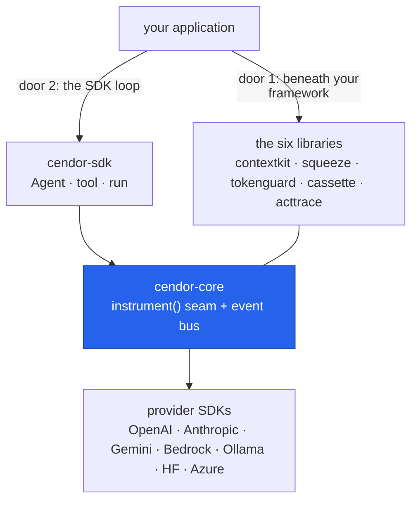

# cendor-sdk

**A governed agent in 10 lines.** `cendor-sdk` is a thin, provider-agnostic agent SDK where
governance — budgets, tamper-evident audit, PII redaction, record/replay testing — is the
foundation, not a plugin. Local-first · no servers · Apache-2.0. Available for
**Python** (`pip install cendor-sdk`) and **TypeScript/JavaScript** (`npm i @cendor/sdk`).

## A first look

A budget-capped run in both languages — the answer comes back with a real cost receipt, and an
over-budget call never fires:

<!-- tabs: lang -->
<!-- tab: Python -->

```python
from cendor.sdk import Agent, run, budget

agent = Agent(name="assistant", model="gpt-4o", instructions="Be helpful.")

with budget(usd=0.10, on_exceed="block"):        # pre-flight cap — refused if the call would exceed
    result = run(agent, "Summarize today's standup notes.")

print(result.output, result.cost)                 # the answer + Decimal money, never a float
```

<!-- tab: TypeScript -->

```ts
import { Agent, run, withBudget } from '@cendor/sdk';

const agent = new Agent({ name: 'assistant', model: 'gpt-4o', instructions: 'Be helpful.' });

const result = await withBudget({ usd: 0.10, onExceed: 'block' }, () =>   // pre-flight cap — refused if it would exceed
  run(agent, "Summarize today's standup notes."));

console.log(result.output, result.cost?.toString());   // the answer + decimal money, never a float
```

<!-- /tabs -->

That's one governance layer; [Getting started](getting-started.md) wires up all four — budget,
audit, PII guard, and record/replay — in ten lines.

## Which door do I need?

Cendor is *production plumbing for LLM applications*, and there are two front doors into it:

- **The [libraries](/docs)** — *plumbing beneath your framework.* Already using LangChain,
  LlamaIndex, or a provider SDK directly? Keep it, and compose the libraries underneath with one
  `instrument()` wrap.
- **`cendor-sdk`** (these docs) — *the whole loop, governed.* Starting fresh, or don't want to
  pick a framework and wire libraries together? The SDK gives you `Agent`, `tool`, and `run` with
  every governance layer one import away.

Both doors expose the **same primitives** — `budget`, `guard`, `Policy`, `AuditLog`, `trace` are
the *real* library objects, re-exported. Start on the SDK and drop down to the libraries later (or
mix them in the same process); it's continuous, never a migration.



## Pages

| Page | What it covers |
|---|---|
| [Getting started](getting-started.md) | Install, a first governed agent, and where each concept lives. |
| [Agents & the loop](agents.md) | `Agent`, `tool`, `run`, `Result`, structured output, streaming, multimodal. |
| [Governance](governance.md) | Budgets, spend attribution, audit + redaction, record/replay testing. |
| [Guardrails](guardrails.md) | `Agent(guardrails=[…])` — a deterministic gate at four stages (input / tool call / tool output / output). |
| [Memory & sessions](memory.md) | `Session`, durable stores, summarization, fitting memory to the window. |
| [Retrieval (RAG)](rag.md) | Governed embeddings, `VectorIndex`, always-on and agentic retrieval. |
| [Multi-agent](multi-agent.md) | Handoff, supervisor, pipelines — one correlated, governed tree. |
| [Providers](providers.md) | The ten provider paths, Hugging Face / Azure AI Foundry / Foundry Local setup, pricing custom models. |
| [Ecosystem & interop](interop.md) | MCP tools, A2A, Foundry/Copilot, OpenTelemetry, human-in-the-loop. |
| [Production hardening](hardening.md) | Retries, checkpointed/resumable runs, durable memory. |
| [Eval & regression testing](eval.md) | Replay recorded trajectories as CI tests — behaviour *and* spend. |
| [FAQ](faq.md) | Common questions, including "libraries or SDK?" in depth. |

## What "governed" means here

Five production concerns ride every run without per-call wiring, because the SDK executes each
model and tool call through [`cendor-core`](/docs/core)'s event bus:

- **Cost** — [`budget(...)`](governance.md#budgets) caps a run *before* an over-budget call executes;
  [`track(...)`](governance.md#attribution) attributes spend per feature/user for free.
- **Safety** — [`Agent(guardrails=[…])`](guardrails.md) gates input / tool calls / tool output /
  output with deterministic checks: block (fail-closed, pre-spend at input), redact, or flag.
- **Evidence** — an [`AuditLog`](governance.md#audit--redaction) records every step in a
  tamper-evident hash chain you can `verify()` offline.
- **Privacy** — [`guard(Policy...)`](governance.md#audit--redaction) redacts PII before the
  provider ever sees it.
- **Testability** — [`cassette`](governance.md#testing--record-once-replay-forever) records a run
  once and replays it forever: offline, deterministic, free.

Every layer is optional — an ungoverned `run()` works with just `cendor-core` installed.

## Install

```bash
pip install "cendor-sdk[openai,anthropic]"   # Python — provider SDKs are optional extras
npm i @cendor/sdk openai                     # TypeScript/JS — providers are peer dependencies
```

Full install options, extras, and the first runnable example:
[Getting started](getting-started.md). Language parity (what's ported, what's Python-only):
[/docs/languages](/docs/languages).

## Design principles

1. **Cooperate through core.** The SDK hard-depends only on `cendor-core`; every governance tool
   integrates through core's bus and interceptor seams — nothing patches anything.
2. **Governed by default, escapable.** Each layer is one argument or one `with` block; removing it
   never breaks the loop.
3. **Local-first, no servers.** Sessions, checkpoints, audit chains, and cassettes are local files.
   Cloud and OpenTelemetry export are optional and opt-in.
4. **Same API in both languages.** `snake_case` ↔ `camelCase`, identical defaults and error names —
   see the [parity matrix](/docs/languages).

See the [CHANGELOG](https://github.com/cendorhq/cendor-sdk/blob/main/CHANGELOG.md) for release
history.
