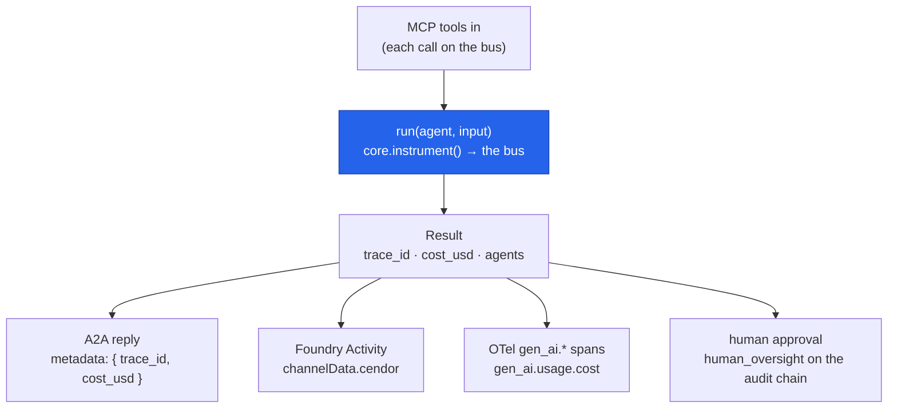

# Ecosystem & interop

Make governed agents first-class citizens elsewhere: consume **MCP** tools, serve over **A2A**,
publish as a **Microsoft 365 / Foundry** custom-engine agent, emit a full-run **OpenTelemetry**
span tree, and wire **human-in-the-loop** approvals into the audit chain. Everything here is
optional and local-first — protocol SDKs are extras, and the telemetry is a no-op unless
OpenTelemetry is installed and configured.

## Quickstart

The most common interop path — turn an MCP server's tools into governed `Tool`s and run an agent
on them. Every MCP call then rides [`cendor-core`](/docs/core)'s bus, so it's budgeted, gated, and
audited like any other call:

<!-- tabs: lang -->
<!-- tab: Python -->

```python
from cendor.sdk import Agent, run, load_mcp_tools

# `session` is your connected MCP client session (transport setup is in the MCP section below).
tools = await load_mcp_tools(session)      # each MCP tool → a governed Tool
agent = Agent(name="assistant", model="gpt-4o", tools=tools, instructions="Use the tools.")
result = await run.aio(agent, "…")         # MCP calls ride the bus: budgeted, gated, audited
```

<!-- tab: TypeScript -->

```ts
import { Agent, run, loadMcpTools } from '@cendor/sdk';

const tools = await loadMcpTools(session);   // each MCP tool → a governed Tool
const agent = new Agent({ name: 'assistant', model: 'gpt-4o', tools, instructions: 'Use the tools.' });
const result = await run(agent, '…');        // MCP calls ride the bus: budgeted, gated, audited
```

<!-- /tabs -->

## Core concepts

**The governed envelope rides along.** The one idea under every integration on this page: when a
governed run crosses a protocol boundary, its governance metadata travels with it. An A2A reply
carries the run's `trace_id` and `cost_usd`; a Foundry Activity puts the same envelope in
`channelData.cendor`; an OpenTelemetry span tree carries `gen_ai.usage.cost`; a human approval lands
as a `human_oversight` entry on the audit chain. So a *consumer* of your agent — another agent, a
Copilot channel, an observability backend — sees governed metadata, not just text. That envelope is
assembled by the libraries: cost by [tokenguard](/docs/tokenguard), the `trace_id` correlation and
audit entries by [acttrace](/docs/acttrace), all on [`cendor-core`](/docs/core)'s bus.

## MCP — consume Model Context Protocol tools

`load_mcp_tools(session)` turns an MCP server's tools into governed `Tool`s (the schema comes
from the server). MCP is async, so use them with `run.aio(...)`. Install the client with
`pip install "cendor-sdk[mcp]"`.

<!-- tabs: lang -->
<!-- tab: Python -->

```python
from mcp import ClientSession
from mcp.client.stdio import stdio_client, StdioServerParameters
from cendor.sdk import Agent, run, load_mcp_tools

params = StdioServerParameters(command="my-mcp-server")
async with stdio_client(params) as (r, w), ClientSession(r, w) as session:
    await session.initialize()
    tools = await load_mcp_tools(session)          # each MCP tool -> a governed Tool
    agent = Agent(name="assistant", model="gpt-4o", tools=tools, instructions="Use the tools.")
    result = await run.aio(agent, "…")             # MCP calls flow through the bus/audit/budget
```

<!-- tab: TypeScript -->

```ts
import { Agent, run, loadMcpTools } from '@cendor/sdk';

// `session` is your MCP client session — the duck-typed shape of @modelcontextprotocol/sdk's
// `Client` (camelCase `listTools()` / `callTool(name, args)`); a fake session tests it offline.
const tools = await loadMcpTools(session);       // each MCP tool -> a governed Tool
const agent = new Agent({ name: 'assistant', model: 'gpt-4o', tools, instructions: 'Use the tools.' });
const result = await run(agent, '…');            // MCP calls flow through the bus/audit/budget
```

<!-- /tabs -->

The integration is duck-typed against a session with async `list_tools()` /
`call_tool(name, args)`, so a fake session tests it offline. `load_mcp_resources(session)` reads
resources into `{uri: contents}`; `load_mcp_prompts` / `get_mcp_prompt` cover prompts.

## A2A — serve an agent over the Agent-to-Agent protocol

<!-- tabs: lang -->
<!-- tab: Python -->

```python
from cendor.sdk import Agent, A2AServer, A2AClient

agent  = Agent(name="greeter", model="gpt-4o", instructions="Greet.")
server = A2AServer(agent)

# In-process (offline / embedded):
client = A2AClient(server)
print(client.card())               # the A2A agent card (name, skills, IO modes)
print(client.send("hi"))           # -> the agent's reply
full = client.send_full("hi")      # full A2A result incl. governance metadata:
                                   #   {"trace_id": ..., "cost_usd": ..., "agents": [...]}

# Over local HTTP (optional, opt-in — stdlib only):
from cendor.sdk.a2a import serve
httpd = serve(agent, host="127.0.0.1", port=8080)   # GET /.well-known/agent-card.json ; POST /
# httpd.serve_forever()  (run in a thread; httpd.shutdown() to stop)
```

<!-- tab: TypeScript -->

```ts
import { Agent, A2AServer, A2AClient, serve } from '@cendor/sdk';

const agent  = new Agent({ name: 'greeter', model: 'gpt-4o', instructions: 'Greet.' });
const server = new A2AServer(agent);

// In-process (offline / embedded):
const client = new A2AClient(server);
console.log(client.card());              // the A2A agent card (name, skills, IO modes)
console.log(await client.send('hi'));    // -> the agent's reply
const full = await client.sendFull('hi'); // full A2A result incl. governance metadata:
                                         //   { metadata: { trace_id, cost_usd, agents } }

// Over local HTTP (optional, opt-in — node:http only):
const httpd = serve(agent, { host: '127.0.0.1', port: 8080 }); // GET /.well-known/agent-card.json ; POST /
// httpd.close() to stop
```

<!-- /tabs -->

Note what rides along: the A2A reply carries the run's `trace_id` and cost, so a *consumer* of
your agent sees governed metadata, not just text.

## Microsoft 365 / Foundry — publish as a custom-engine agent

`FoundryAdapter` speaks the Bot Framework **Activity** protocol — the surface a custom-engine
agent exposes to Copilot / Teams / Azure AI Foundry:

<!-- tabs: lang -->
<!-- tab: Python -->

```python
from cendor.sdk import Agent, FoundryAdapter

adapter = FoundryAdapter(Agent(name="assistant", model="gpt-4o", instructions="Help."))

# In your web endpoint:
reply = adapter.on_activity(incoming_activity)   # -> outgoing message Activity, or None
# reply["channelData"]["cendor"] carries {"trace_id", "cost_usd", "agents"}
adapter.manifest()                                # minimal registration manifest
```

<!-- tab: TypeScript -->

```ts
import { Agent, FoundryAdapter } from '@cendor/sdk';

const adapter = new FoundryAdapter(new Agent({ name: 'assistant', model: 'gpt-4o', instructions: 'Help.' }));

// In your web endpoint:
const incomingActivity = { type: 'message', text: 'hi', from: { id: 'user' } };
const reply = await adapter.onActivity(incomingActivity);  // -> outgoing message Activity, or null
// reply?.channelData.cendor carries { trace_id, cost_usd, agents }
adapter.manifest();                                        // minimal registration manifest
```

<!-- /tabs -->

## OpenTelemetry — a full-run `gen_ai` span tree

`span_tree(result)` emits a `gen_ai.*` span tree for a completed run, so the whole trajectory
shows up in Foundry / Datadog / Jaeger: a root `agent.run`, a child per agent segment, and a
grandchild per model call (`chat {model}`) and tool execution (`execute_tool {name}`). For
**live** spans as the run progresses, wrap it in `with live_spans():`. Uses OpenTelemetry
directly (extra `[otel]`) and is a **no-op returning `False`** if OTel isn't installed.

<!-- tabs: lang -->
<!-- tab: Python -->

```python
from cendor.sdk import run
from cendor.sdk.otel import span_tree

result = run(agent, "…")
span_tree(result)     # spans exported to your configured OTel pipeline; mirrors result's tree
```

<!-- tab: TypeScript -->

```ts
import { run, spanTree, liveSpans } from '@cendor/sdk';

const result = await run(agent, '…');
spanTree(result);     // spans exported to your configured OTel pipeline; mirrors result's tree

const live = liveSpans();   // or stream spans as the run progresses…
await run(agent, '…');
live.close();               // …and stop
```

<!-- /tabs -->

Spans carry `gen_ai.request.model`, `gen_ai.system`, `gen_ai.usage.input_tokens` /
`output_tokens`, `gen_ai.usage.cost`, and per-agent `gen_ai.agent.name`. Each child call span also
carries a 1-based `cendor.step` ordinal, and the root carries `cendor.run.id` plus the run's
usage/cost rollups — so `live_spans` reads the same as the post-hoc `span_tree`. Pass
`conversation_id=` (Python) / `{ conversationId }` (TypeScript) — e.g. your session /
`SQLiteSessionStore` key — to stamp `gen_ai.conversation.id` on the root, so a backend can group
the runs of one multi-turn conversation.

Pass `label=` (Python) / `{ label }` (TypeScript) to stamp a short, human-authored
`cendor.run.label` on the root — a monitor can then show *what a run was for* (e.g.
`"nightly refund sweep"`). **Never derive a label from the prompt:** prompts and tool-argument
values stay off spans by design (the monitor may be pointed at shared infra); a label is a
deliberate, non-sensitive tag you choose.

### Observability & Cendor Monitor

That same wire is what makes an SDK run *watchable*: `run(session=…)` auto-stamps
`gen_ai.conversation.id` so a backend groups a conversation, and one `docker run` of
[**Cendor Monitor**](/docs/monitor) renders it as a **run journey** (the whole conversation with
tokens/cost/latency per step, governance inline). Full walkthrough — export to any backend or watch
locally, with the honesty rails — on the SDK's [Observability page](/docs/sdk/observability).

## Human-in-the-loop — approvals in the audit chain

[acttrace](/docs/acttrace) records *that* oversight happened; the pause/approve/resume mechanics
are your app's job. `require_approval` wraps a tool so each call consults an `approver` (the
pause) and records the verdict via `decision.human_oversight(...)` on the **same audit chain**
the run is correlated by:

<!-- tabs: lang -->
<!-- tab: Python -->

```python
from cendor.sdk import Agent, run, AuditLog
from cendor.sdk.hitl import require_approval

def approver(tool_name, args):
    return args["amount"] < 100, "auto-approved under $100"   # -> (approved, note)

refund = require_approval(issue_refund, approver=approver, reviewer="ops@bank")
agent  = Agent(name="support", model="gpt-4o", tools=[refund], instructions="Use tools.")

log = AuditLog(system="support", risk_tier="high", path="audit.jsonl")
run(agent, "Refund order 42 for $50", audit=log)
# audit.jsonl gains a human_oversight entry (approved/rejected), hash-chained & verify()-able.
# On rejection the real tool never runs and the model gets a denial to react to.
```

<!-- tab: TypeScript -->

```ts
import { Agent, run, AuditLog, requireApproval } from '@cendor/sdk';

const approver = (toolName, args): [boolean, string] =>
  [args.amount < 100, 'auto-approved under $100'];   // -> [approved, note]

const refund = requireApproval(issueRefundTool, { approver, reviewer: 'ops@bank' });
const agent  = new Agent({ name: 'support', model: 'gpt-4o', tools: [refund],
                           instructions: 'Use tools.' });

const audit = new AuditLog('support', { riskTier: 'high', path: 'audit.jsonl' });
await run(agent, 'Refund order 42 for $50', { audit });
// audit.jsonl gains a human_oversight entry (approved/rejected), hash-chained & verify()-able.
// On rejection the real tool never runs and the model gets a denial to react to.
```

<!-- /tabs -->

In production the `approver` is where you block on a reviewer — a prompt, a queue, a webhook —
then return the decision to resume (or deny) the run.

## How it works

One governed `run()` produces one `Result`; each interop surface *projects* that result outward,
carrying the same governance envelope (`trace_id` + `cost_usd`) across the protocol boundary:



## Plugs into the stack

Interop surfaces don't add governance — they *carry* the governance the run already produced,
through the same libraries, never a direct import:

- **↔ [tokenguard](/docs/tokenguard)** — the `cost_usd` on an A2A reply / Foundry Activity and the
  `gen_ai.usage.cost` on a span are the run's priced spend.
- **↔ [acttrace](/docs/acttrace)** — the `trace_id` correlates every projected surface to the run,
  and a `require_approval` decision is a `human_oversight` entry on the tamper-evident chain.
- **↔ [cendor-core](/docs/core)** — MCP tool calls ride the `instrument()` seam and the bus like any
  other call, and `span_tree` reads the bus's normalized events to emit the OTel tree.

## Honest limits

- **MCP stdio transport is a local-process affair** — on edge runtimes use HTTP/SSE transports.
- **A2A's built-in HTTP server is stdlib-simple** — fine for local and embedded use; put a real
  server in front of it for production traffic.
- **`span_tree` exports; it doesn't collect.** You still need an OTel pipeline (collector,
  backend) configured in your process.
- **`require_approval` is synchronous at the tool boundary** — a long human pause holds the run
  open; for hours-long approvals, checkpoint the run and resume it
  ([hardening](hardening.md#checkpointed--resumable-runs)).
