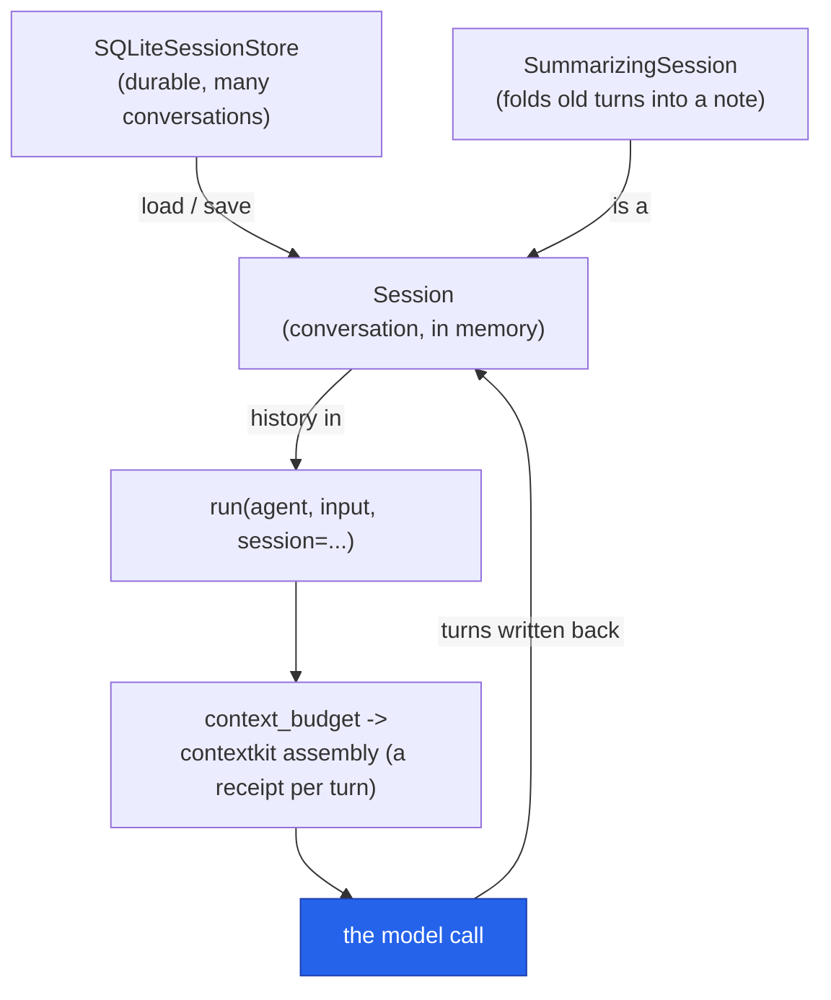

# Memory & sessions

How an agent remembers: a `Session` carries the conversation across `run()` calls, a store makes
it durable across processes, summarization keeps it bounded, and `context_budget` fits it to the
model's window. All local-first — files and SQLite, no server.

## Quickstart

<!-- tabs: lang -->
<!-- tab: Python -->

```python
from cendor.sdk import Agent, run, Session

agent = Agent(name="assistant", model="gpt-4o", instructions="Be helpful.")

session = Session()
run(agent, "My name is Alice.", session=session)
result = run(agent, "What's my name?", session=session)   # -> knows "Alice"
```

<!-- tab: TypeScript -->

```ts
import { Agent, run, Session } from '@cendor/sdk';

const agent = new Agent({ name: 'assistant', model: 'gpt-4o', instructions: 'Be helpful.' });

const session = new Session();
await run(agent, 'My name is Alice.', { session });
const result = await run(agent, "What's my name?", { session });   // -> knows "Alice"
```

<!-- /tabs -->

## Core concepts

### Conversation memory — `Session`

Pass the same `Session` to successive `run()` calls: the canonical conversation is carried in,
and the run writes it back. Persistence is one call away:

<!-- tabs: lang -->
<!-- tab: Python -->

```python
session.save("chat.json")
session = Session.load("chat.json")     # resume later, same process or not
```

<!-- tab: TypeScript -->

```ts
session.save('chat.json');
const resumed = Session.load('chat.json');   // resume later, same process or not
```

<!-- /tabs -->

### Durable, multi-conversation memory — `SQLiteSessionStore`

Many named conversations in one local SQLite file:

<!-- tabs: lang -->
<!-- tab: Python -->

```python
from cendor.sdk import SQLiteSessionStore

store = SQLiteSessionStore("sessions.db")
session = store.load("user-42")          # empty Session if unknown
run(agent, "hi, I'm Alice", session=session)
store.save("user-42", session)           # survives restarts

# next process:
session = store.load("user-42")          # remembers Alice
```

<!-- tab: TypeScript -->

```ts
import { SqliteSessionStore } from '@cendor/sdk';   // note the casing: Sqlite, not SQLite

const store = new SqliteSessionStore('sessions.db');
const session = store.load('user-42');    // empty Session if unknown
await run(agent, "hi, I'm Alice", { session });
store.save('user-42', session);           // survives restarts

// next process:
const resumed = store.load('user-42');    // remembers Alice
```

<!-- /tabs -->

### In-memory store (TypeScript) — `MemorySessionStore`

TypeScript ships an in-memory keyed store — the ephemeral counterpart to `SqliteSessionStore`, handy
for tests and short-lived processes where durability isn't needed. Python has no in-memory *store*
class: a plain `Session` (or your own dict keyed by user) covers the same ground.

<!-- tabs: lang -->
<!-- tab: Python -->

> **TypeScript only.** Python has no in-memory session *store* — use a plain `Session` per
> conversation, or a dict of them keyed by user. Durable storage is `SQLiteSessionStore`. See the
> [parity matrix](/docs/languages).

<!-- tab: TypeScript -->

```ts
import { Agent, run, MemorySessionStore } from '@cendor/sdk';

const store = new MemorySessionStore();     // in-memory, keyed — nothing persisted
const session = store.load('user-42');      // empty Session if unknown
await run(agent, 'hi', { session });
store.save('user-42', session);             // kept for this process only
```

<!-- /tabs -->

### Rolling summarization — `SummarizingSession`

A long conversation eventually outgrows any window. `SummarizingSession` *folds* old turns into a
durable summary note (keeping recent turns verbatim), so memory stays bounded without losing the
gist:

<!-- tabs: lang -->
<!-- tab: Python -->

```python
from cendor.sdk import SummarizingSession, run

mem = SummarizingSession(model="gpt-4o-mini", max_messages=20, keep_recent=8)
for msg in conversation:
    run(agent, msg, session=mem)   # old turns fold into a memory note; recent stay verbatim
```

<!-- tab: TypeScript -->

```ts
import { SummarizingSession, run } from '@cendor/sdk';

const mem = new SummarizingSession({ model: 'gpt-4o-mini', maxMessages: 20, keepRecent: 8 });
for (const msg of conversation) {
  await run(agent, msg, { session: mem });  // old turns fold into a note; recent stay verbatim
}
```

<!-- /tabs -->

The summarizer is pluggable: `model=` builds a governed one-shot summarizer (`llm_summarizer`) —
its model call rides the same budget/audit seams as everything else — or pass your own
`summarizer=` callable for offline/extractive summaries.

### Fitting memory to the window — `context_budget`

Where `SummarizingSession` *folds*, `context_budget` *trims*: set
`Agent(context_budget=8000)` and each turn assembles the history to that token budget via
[`contextkit`](/docs/contextkit), peeling the oldest turns first ([`squeeze`](/docs/squeeze)
compression engages only via direct contextkit use — the SDK's trim path never compresses),
emitting an audited `AssemblyReport` — a receipt of what was kept, shrunk, or dropped.

### Long-term / semantic memory

For facts that should survive *across* sessions, memory becomes retrieval: back a `VectorIndex`
(or your own vector store) and attach it as the agent's `retriever` — past facts come back by
relevance, injected exactly like RAG documents. See [Retrieval (RAG)](rag.md).

So, in one line each: conversation memory = `Session` / `SummarizingSession` · durable memory =
`SQLiteSessionStore` · window fitting = `context_budget` · semantic memory = a retriever ·
crash recovery = [`checkpoint=`](hardening.md#checkpointed--resumable-runs).

## How it works



## Plugs into the stack

Assembly decisions are **audited**: when `context_budget` is set, each turn's `AssemblyReport`
lands on the bus, so an [`AuditLog`](governance.md#audit--redaction) records what the model
actually saw — not just what it answered. Session files and SQLite stores are plain local
artifacts; put them on shared storage if processes must hand off.

## Honest limits

- **`Session` is not thread-safe shared state** — one conversation, one writer at a time. For
  concurrent users, load/save per conversation via `SQLiteSessionStore`.
- **Summarization is lossy by design.** `SummarizingSession` keeps the gist, not the transcript;
  when the verbatim record matters, that's the [audit chain](governance.md)'s job.
- **`context_budget` trims silently past the budget** — deliberately. Read the
  `AssemblyReport` (or the audit entry) when you need to know what was dropped. An assembly
  *failure* is silent but **observable** (since 1.7.0): the fallback to raw messages emits a
  `ContextBudgetFallback` diagnostic on core's bus (`from cendor.sdk.runner import
  ContextBudgetFallback`) — subscribe and alert on it if a fallback matters to you.
- **No distributed memory.** Stores are local files by design; sharing them across machines is
  your storage layer's job, not the SDK's.
