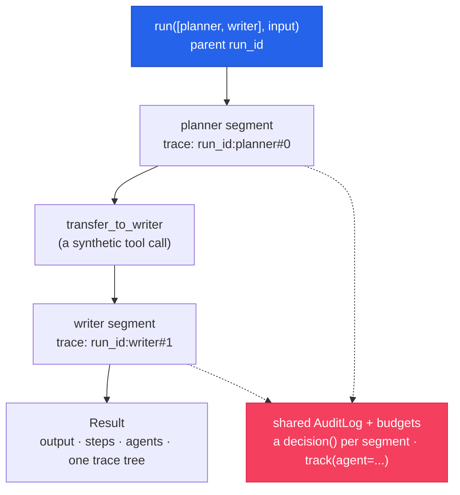

# Multi-agent

Hand off between agents, route through a supervisor, or pipeline them in sequence or parallel —
and get the whole trajectory back as **one governed, correlated tree**: one parent run id, one
audit chain, per-agent budgets and spend attribution.

## Quickstart — handoff

An agent transfers control to a named peer via a synthetic `transfer_to_<peer>` tool. The
conversation is canonical (provider-agnostic), so handoff works **across providers** — an OpenAI
planner hands off to an Anthropic writer with no rewrite:

<!-- tabs: lang -->
<!-- tab: Python -->

```python
from cendor.sdk import Agent, run

writer = Agent(name="writer", model="claude-opus-4-8", instructions="Write the brief.")
planner = Agent(
    name="planner", model="gpt-4o",
    instructions="Plan, then hand off to the writer.",
    handoffs=["writer"],          # or handoffs=[handoff("writer")]
)

# A list means a handoff team: the first agent is the entry point, the rest are reachable peers.
result = run([planner, writer], "Research X and write a brief")
print(result.output)              # the writer's final answer
print(result.agents)              # ["planner", "writer"]
```

<!-- tab: TypeScript -->

```ts
import { Agent, run } from '@cendor/sdk';

const writer = new Agent({ name: 'writer', model: 'claude-opus-4-8',
                           instructions: 'Write the brief.' });
const planner = new Agent({
  name: 'planner', model: 'gpt-4o',
  instructions: 'Plan, then hand off to the writer.',
  handoffs: ['writer'],           // or handoffs: [handoff('writer')]
});

// An array means a handoff team: the first agent is the entry point, the rest are reachable peers.
const result = await run([planner, writer], 'Research X and write a brief');
console.log(result.output);       // the writer's final answer
console.log(result.agents);       // ["planner", "writer"]
```

<!-- /tabs -->

Handoff runs stream too — `run.stream([...])` / `run.astream([...])` yield events through to the
terminal `RunComplete`, same as single-agent [streaming](agents.md#streaming).

## Core concepts

### One run, one tree

Every multi-agent run gets one parent `run_id`. Each agent segment runs under a nested child
trace id (`{run_id}:{agent}#i`), so:

| Concept | Where it lives |
|---|---|
| Parent run id | `result.trace_id` |
| Per-agent child id | `step.trace_id` (starts with the parent) |
| Which agent produced a step | `step.agent` |
| Audit correlation | one `decision()` per agent segment on the shared `AuditLog` |
| Spend attribution | `track(agent=…)` per segment → `report(group_by=["agent"])` |

### Supervisor / router

A coordinator agent routes to sub-agents by handoff:

<!-- tabs: lang -->
<!-- tab: Python -->

```python
from cendor.sdk import Agent, supervisor, AuditLog

coordinator = Agent(name="coordinator", model="gpt-4o", instructions="Route to a specialist.")
researcher  = Agent(name="researcher",  model="gpt-4o", instructions="Do the research.")
writer      = Agent(name="writer",      model="claude-opus-4-8", instructions="Write it up.")

log = AuditLog(system="research-team", risk_tier="high", path="team.jsonl")
result = supervisor(coordinator, [researcher, writer], "Investigate X and write it up", audit=log)
# One correlated audit trail: a decision per agent segment, every llm_call/tool_call chained.
```

<!-- tab: TypeScript -->

```ts
import { Agent, supervisor, AuditLog } from '@cendor/sdk';

const coordinator = new Agent({ name: 'coordinator', model: 'gpt-4o',
                                instructions: 'Route to a specialist.' });
const researcher  = new Agent({ name: 'researcher', model: 'gpt-4o',
                                instructions: 'Do the research.' });
const writer      = new Agent({ name: 'writer', model: 'claude-opus-4-8',
                                instructions: 'Write it up.' });

const audit = new AuditLog('research-team', { riskTier: 'high', path: 'team.jsonl' });
const result = await supervisor(coordinator, [researcher, writer],
  'Investigate X and write it up', { audit });
// One correlated audit trail: a decision per agent segment, every llm_call/tool_call chained.
```

<!-- /tabs -->

### Sequential & parallel pipelines

<!-- tabs: lang -->
<!-- tab: Python -->

```python
from cendor.sdk import sequential, parallel, parallel_async

# Pipe each agent's output into the next.
result = sequential([drafter, editor, factchecker], "Write about X")
print(result.output)                     # the last agent's output

# Fan out over the same input; result.output is {agent_name: output}.
result = parallel([summarizer_a, summarizer_b], "Summarize this document")

# Real concurrency (async):
result = await parallel_async([a, b, c], "Same task, three takes")
```

<!-- tab: TypeScript -->

```ts
import { sequential, parallel, parallelAsync } from '@cendor/sdk';

// Pipe each agent's output into the next.
let result = await sequential([drafter, editor, factchecker], 'Write about X');
console.log(result.output);              // the last agent's output

// Fan out over the same input; result.output is { [agentName]: output }.
result = await parallel([summarizerA, summarizerB], 'Summarize this document');

// Real concurrency:
result = await parallelAsync([a, b, c], 'Same task, three takes');
```

<!-- /tabs -->

### Per-agent budgets & attribution

<!-- tabs: lang -->
<!-- tab: Python -->

```python
from cendor.sdk import Agent, run, report

# Cap a single agent's spend; the orchestrator enforces it around that agent's segment.
expensive = Agent(name="deep", model="claude-opus-4-8", instructions="Think hard.", max_usd=0.50)
cheap     = Agent(name="fast", model="gpt-4o-mini",     instructions="Be quick.")

run([cheap, expensive], "...")

# Spend is auto-attributed by agent (track(agent=...)):
report(group_by=["agent"]).assert_under(usd=1.00, agent="deep")
```

<!-- tab: TypeScript -->

```ts
import { Agent, run, report } from '@cendor/sdk';

// Cap a single agent's spend; the orchestrator enforces it around that agent's segment.
const expensive = new Agent({ name: 'deep', model: 'claude-opus-4-8',
                              instructions: 'Think hard.', maxUsd: 0.50 });
const cheap     = new Agent({ name: 'fast', model: 'gpt-4o-mini', instructions: 'Be quick.' });

await run([cheap, expensive], '...');

// Spend is auto-attributed by agent (track({ agent: ... })):
report(['agent']).assertUnder(1.00, { agent: 'deep' });
```

<!-- /tabs -->

A team-wide cap is just an ordinary [`budget(...)`](governance.md#budgets) around the whole
`run([...])`. Long team runs can also checkpoint and resume — see
[Production hardening](hardening.md#checkpointed--resumable-runs).

## How it works



Because every segment's `trace_id` starts with the parent id, `result.steps` is one ordered tree
— and [`span_tree(result)`](interop.md#opentelemetry--a-full-run-gen_ai-span-tree) exports the
same structure as OpenTelemetry `gen_ai.*` spans.

## Plugs into the stack

Multi-turn team memory works exactly like single-agent memory — pass a `Session`
([Memory & sessions](memory.md)). Governance wrappers apply at whichever granularity you choose:
around the team (`budget`/`guard`), or per agent (`max_usd`, per-segment audit decisions).

## Honest limits

- **Orchestration is explicit.** Handoffs go to *named* peers; there's no emergent agent
  discovery — by design, so the audit tree is always closed over a known set.
- **`parallel` fans out over the same input** — it isn't a task queue or a scheduler; real
  distributed execution is your infrastructure's job.
- **A handoff carries the whole canonical conversation.** Long trajectories can get expensive
  per segment — bound them with `context_budget` or per-agent budgets.
