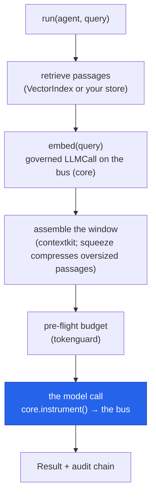

# Retrieval (RAG)

Give the agent your documents — with the retrieval itself governed. The SDK is not a vector
database: embeddings are governed calls, retrieval is a seam, and your store (pgvector, Pinecone,
Chroma, …) plugs in as a one-function callable.

## Quickstart

<!-- tabs: lang -->
<!-- tab: Python -->

```python
from cendor.sdk import Agent, run, VectorIndex

kb = VectorIndex(model="text-embedding-3-small", provider="openai")   # or embedder=<your fn>
kb.add(["Refunds within 30 days.", "Support hours are 9-5 UTC."])

agent = Agent(name="rag", model="gpt-4o", retriever=kb.as_retriever(k=3),
              instructions="Answer only from the provided context.")
run(agent, "What's the refund window?")   # passages retrieved + injected, embed call governed
```

<!-- tab: TypeScript -->

```ts
import OpenAI from 'openai';
import { Agent, run, VectorIndex } from '@cendor/sdk';

const kb = new VectorIndex({ model: 'text-embedding-3-small', client: new OpenAI() });
await kb.add(['Refunds within 30 days.', 'Support hours are 9-5 UTC.']);

const agent = new Agent({ name: 'rag', model: 'gpt-4o', retriever: kb.asRetriever(3),
                          instructions: 'Answer only from the provided context.' });
await run(agent, "What's the refund window?");  // passages retrieved + injected, embed governed
```

<!-- /tabs -->

## Core concepts

### Governed embeddings — `embed`

`embed(model, inputs)` / `aembed(...)` return one vector per input and emit a governed `LLMCall`
— tokens and cost captured on the bus, correlated by `trace` — for OpenAI-family providers:

<!-- tabs: lang -->
<!-- tab: Python -->

```python
from cendor.sdk import embed, trace

with trace("index-build"):
    vectors = embed("text-embedding-3-small", ["hello", "world"], provider="openai")
```

<!-- tab: TypeScript -->

```ts
import OpenAI from 'openai';
import { embed, trace } from '@cendor/sdk';

const vectors = await trace('index-build', () =>
  embed('text-embedding-3-small', ['hello', 'world'], { client: new OpenAI() }));
```

<!-- /tabs -->

So an index build shows up in [`report()`](governance.md#attribution) and the
[audit chain](governance.md#audit--redaction) like any other spend — no invisible embedding
bills.

### Always-on RAG — `Agent(retriever=...)`

A `retriever` is any `query -> list[str]` callable. Before each model call, retrieved passages
are injected as a system message — and when `Agent(context_budget=…)` is set, they're packed into
the window by [contextkit](/docs/contextkit) alongside the conversation, with
[squeeze](/docs/squeeze) compressing oversized passages when it's installed. So retrieval feeds the
same assembly layer the mapping tables point RAG at. `VectorIndex` is a dependency-free in-memory
cosine index built on the governed `embed()` — right for small corpora, demos, and tests. For
scale, wrap your own store:

<!-- tabs: lang -->
<!-- tab: Python -->

```python
def retriever(query: str) -> list[str]:
    return [row.text for row in my_pgvector_search(query, k=3)]

agent = Agent(name="rag", model="gpt-4o", retriever=retriever, instructions="...")
```

<!-- tab: TypeScript -->

```ts
const retriever = async (query: string) =>
  (await myPgvectorSearch(query, 3)).map((row) => row.text);

const agent = new Agent({ name: 'rag', model: 'gpt-4o', retriever, instructions: '...' });
```

<!-- /tabs -->

### Agentic RAG — retrieval as a tool

Let the model decide *when* to retrieve — expose the store as a `@tool`, and each retrieval
becomes a governed, audited `ToolCall` in `result.tool_steps`:

<!-- tabs: lang -->
<!-- tab: Python -->

```python
from cendor.sdk import tool

@tool
def search_kb(query: str, top_k: int = 5) -> list[str]:
    """Retrieve relevant passages."""
    return [h.text for h in kb.search(query, k=top_k)]

agent = Agent(name="rag", model="gpt-4o", tools=[search_kb])
```

<!-- tab: TypeScript -->

```ts
import { tool } from '@cendor/sdk';
import { z } from 'zod';

const searchKb = tool(async ({ query, topK }) =>
  (await kb.search(query, topK)).map((h) => h.text), {
  name: 'search_kb',
  description: 'Retrieve relevant passages',
  parameters: z.object({ query: z.string(), topK: z.number().default(5) }),
});

const agent = new Agent({ name: 'rag', model: 'gpt-4o', tools: [searchKb] });
```

<!-- /tabs -->

**Which to pick?** Always-on retrieval (`retriever=`) when every question needs the corpus —
one search per turn, no extra model round-trip. Agentic retrieval (a tool) when retrieval is
occasional or composable with other tools — the model spends a turn deciding, and the decision
itself is in the audit trail.

### Semantic memory is the same mechanism

Long-term memory across sessions is retrieval wearing a different hat: store facts in the index,
attach it as the `retriever`, and past knowledge comes back by relevance. See
[Memory & sessions](memory.md#long-term--semantic-memory).

## How it works

Retrieval is a seam, not a database — one governed embed call, then assembly into the window before
the model ever runs:



## Plugs into the stack

Retrieved passages become part of the prompt, so retrieval sits *inside* the governed loop, not
beside it:

- **↔ [contextkit](/docs/contextkit)** (+ [squeeze](/docs/squeeze)) — with `context_budget` set,
  passages are assembled into the token window alongside the conversation, oversized ones compressed
  reversibly. This is the assembly layer the [feature map](getting-started.md#5-where-each-concept-lives)
  routes RAG to.
- **↔ [cendor-core](/docs/core)** — every `embed()` is a governed `LLMCall` on the bus, correlated
  by `trace`, so an index build isn't an invisible bill.
- **↔ [tokenguard](/docs/tokenguard)** — `budget` caps an index build and `track` attributes it,
  the same as any other spend.
- **↔ [acttrace](/docs/acttrace) / [cassette](/docs/cassette)** — `AuditLog` records the retrieval,
  and cassette replays a whole RAG trajectory — retrieval included — offline in CI.

## Honest limits

- **`VectorIndex` is in-memory and exact-scan** — perfect for tests and small corpora, wrong for
  millions of chunks. Bring a real store via the `retriever` seam; the SDK won't grow one.
- **Embedding governance is OpenAI-family today** — elsewhere, embed outside and hand vectors in
  (`embedder=`), or wrap your embedding call with `instrument()` yourself.
- **Injected context counts against the window.** Combine `retriever=` with
  [`context_budget`](memory.md#fitting-memory-to-the-window--context_budget) so retrieval can't
  crowd out the conversation.
- **Retrieval quality is yours.** Chunking, ranking, and freshness live in your store; the SDK
  governs the calls, it doesn't tune them.
- **Always-on retrieval injects passages as a *system* message.** Retrieved text enters with
  system-role trust, so if your corpus holds untrusted or user-submitted content, treat it as a
  prompt-injection surface — sanitize it, or expose retrieval as a tool (agentic RAG) so passages
  arrive with tool-role trust instead.
